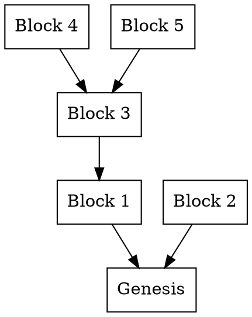
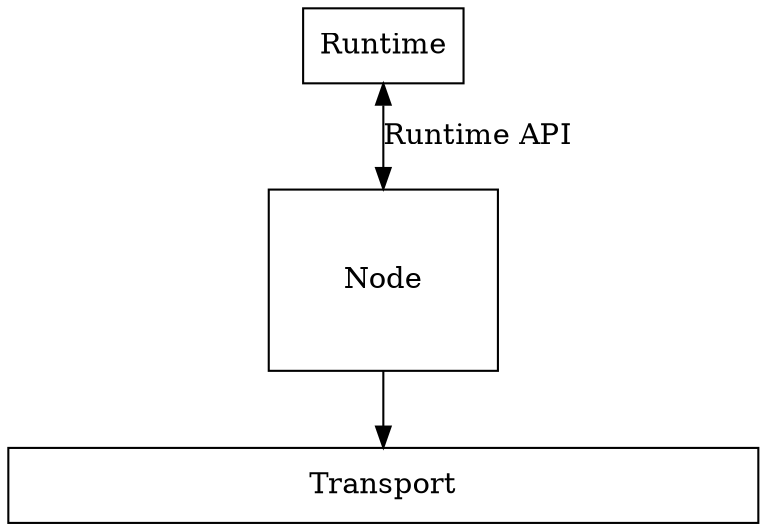

# Architecture Overview

This section aims to describe, at a high level, the code architecture and subsystems involved in the implementation of an individual Parachain Host. It also illuminates certain subtleties and challenges faced in the design and implementation of those subsystems.

To recap, Polkadot includes a blockchain known as the relay-chain. A blockchain is a Directed Acyclic Graph (DAG) of state transitions, where every block can be considered to be the head of a linked-list (known as a "chain" or "fork") with a cumulative state which is determined by applying the state transition of each block in turn. All paths through the DAG terminate at the Genesis Block. In fact, the blockchain is a tree, since each block can have only one parent.



A blockchain network is comprised of nodes. These nodes each have a view of many different forks of a blockchain and must decide which forks to follow and what actions to take based on the forks of the chain that they are aware of.

So in specifying an architecture to carry out the functionality of a Parachain Host, we have to answer two categories of questions:

1. What is the state-transition function of the blockchain? What is necessary for a transition to be considered valid, and what information is carried within the implicit state of a block?
1. Being aware of various forks of the blockchain as well as global private state such as a view of the current time, what behaviors should a node undertake? What information should a node extract from the state of which forks, and how should that information be used?

The first category of questions will be addressed by the Runtime, which defines the state-transition logic of the chain. Runtime logic only has to focus on the perspective of one chain, as each state has only a single parent state.

The second category of questions addressed by Node-side behavior. Node-side behavior defines all activities that a node undertakes, given its view of the blockchain/block-DAG. Node-side behavior can take into account all or many of the forks of the blockchain, and only conditionally undertake certain activities based on which forks it is aware of, as well as the state of the head of those forks.



It is also helpful to divide Node-side behavior into two further categories: Networking and Core. Networking behaviors relate to how information is distributed between nodes. Core behaviors relate to internal work that a specific node does. These two categories of behavior often interact, but can be heavily abstracted from each other. Core behaviors care that information is distributed and received, but not the internal details of how distribution and receipt function. Networking behaviors act on requests for distribution or fetching of information, but are not concerned with how the information is used afterwards. This allows us to create clean boundaries between Core and Networking activities, improving the modularity of the code.

```text
          ___________________                    ____________________
         /       Core        \                  /     Networking     \
         |                   |  Send "Hello"    |                    |
         |                   |-  to "foo"   --->|                    |
         |                   |                  |                    |
         |                   |                  |                    |
         |                   |                  |                    |
         |                   |    Got "World"   |                    |
         |                   |<--  from "bar" --|                    |
         |                   |                  |                    |
         \___________________/                  \____________________/
                                                   ______| |______
                                                   ___Transport___

```

Node-side behavior is split up into various subsystems. Subsystems are long-lived workers that perform a particular category of work. Subsystems can communicate with each other, and do so via an [Overseer](node/overseer.md) that prevents race conditions.

Runtime logic is divided up into Modules and APIs. Modules encapsulate particular behavior of the system. Modules consist of storage, routines, and entry-points. Routines are invoked by entry points, by other modules, upon block initialization or closing. Routines can read and alter the storage of the module. Entry-points are the means by which new information is introduced to a module and can limit the origins (user, root, parachain) that they accept being called by. Each block in the blockchain contains a set of Extrinsics. Each extrinsic targets a a specific entry point to trigger and which data should be passed to it. Runtime APIs provide a means for Node-side behavior to extract meaningful information from the state of a single fork.

These two aspects of the implementation are heavily dependent on each other. The Runtime depends on Node-side behavior to author blocks, and to include Extrinsics which trigger the correct entry points. The Node-side behavior relies on Runtime APIs to extract information necessary to determine which actions to take.
