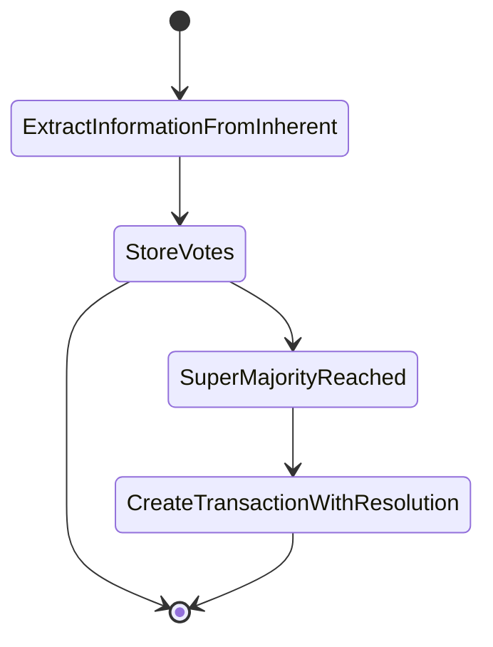
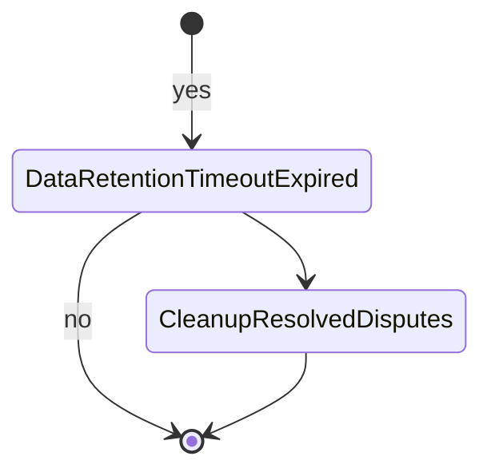
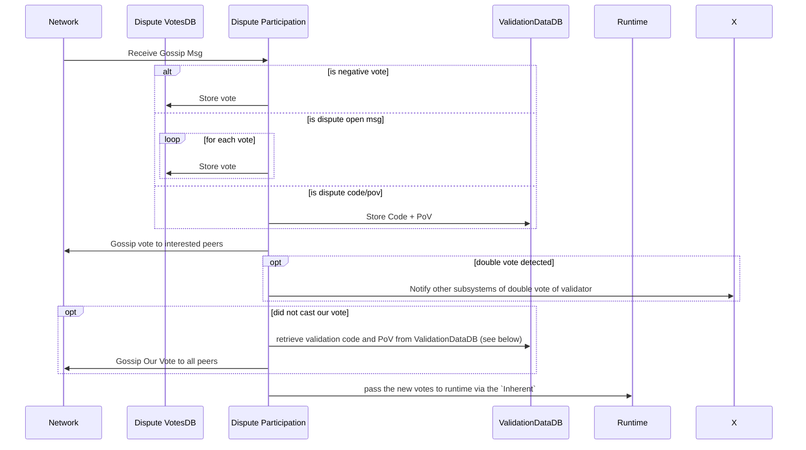
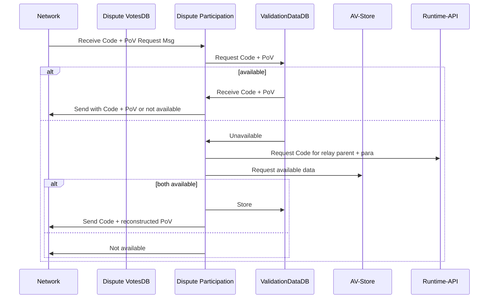
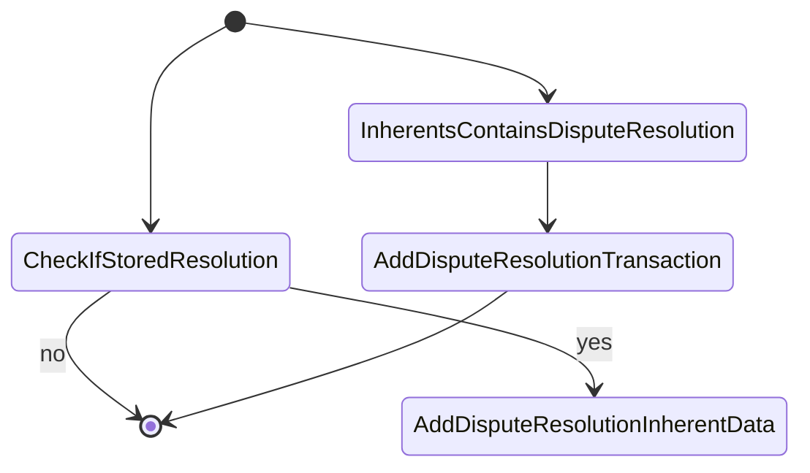
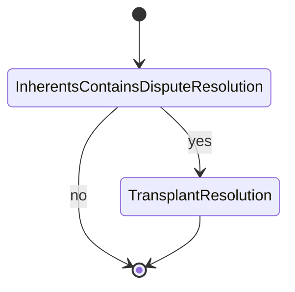
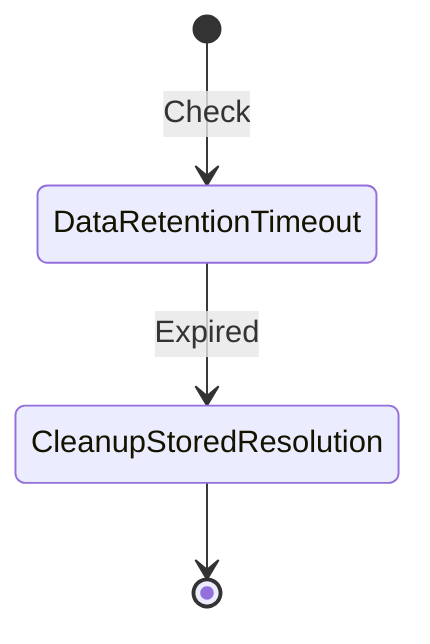

# Dispute Component Partitions

## Understanding fork awareness

There are parts regarding storage. Node side, runtime side and state root persistence.

* Dispute resolution must be persisted in the state-root of each and every fork.
* Dispute resolution.

## Duties

### VotesDB

#### Node

* Stores all cast votes on the node side.
* Allows other subsystems to query disputes
  * by `ValidatorId`
  * by `ValidatorIndex` and `SessionIndex`
  * by `SessionIndex`

* Cleans up votes based on session index

#### StateRoot

Does not interact with the state root.

#### Runtime

Has no interaction with the runtime.

### Participation

Handles all concerns of dispute interactions.
This consists mostly of these parts:

* Receiving and distributing Votes via Gossip
* Running validation code to cast our own vote
* Dispute resolution and rewarding on quorum being reached

with parts on the node side and parts in the runtime.
#### Node

Receives messages from

* network gossip containing..
  * individual `Vote`s or sets of `Votes`
  * `Code` + `PoV` as a response to such as request
  * a request to another validator (from which a vote was received before) to send `Code` + `PoV` our way

Sends messages

* to the `VotesDB` to ..
  * store `Vote`s
  * query `Vote`s for a particular

* to the network for ..
  * requesting `Code` + `PoV`
  * broadcasting received `Vote`s

* Acts on disputes messages by ..
  * fetching the `PoV` + `Code` blocks
    * running the validation code for the block/candidate

#### Transition Node -> Runtime

* Incoming gossip votes are...
  * stored on the node by sending a message to `VotesDB` (for gossip purposes)
  * passed on via `InherentData` to the runtime where they are stored (fork-aware)

#### Runtime

* incoming gossip mesages via an inherent provided by proposer are
  * stored them within the runtime storage (not the state root!)
  * decided upon set of stored votes for the particular dispute
  * decided upon set of stored votes if the dispute is concluded
  * starts the timeout for cleanup of persisted data on the runtime side

---

The sequential flow of the runtime logic part, on entry.
Note that the storage is fork aware with all its implications.

---

Cleanup obsolete votes of concluded disputes that are prior to finalization of a block plus a certain timeout.

Happens on `on_finalize`.

#### Node

##### Gossip / VotesDB / Interaction

Being polite (i.e. not sending messages to peers that we know already have a particular Vote) is an expected property of the
gossip, as such the votes have to be stored per validator peer. Note that this is not related per peer, since all active validators should be voting, irrespectively of their current view.

There is a second component of storing the code and PoV required for
validation of a block, which is request from other peers, for which
we know that they must have it, since they already cast their vote.

If code + PoV are requested from us.

`ValidationDataDB` is most likely part of the `VotesDB`.

## DisputeTransplanter

Has the duty of transplanting previously seen disputes
from one fork to another.
This implies the dispute transplanter must
track all `InherentData` chunks that end up in blocks
and inject them into chains, that do not have the dispute
resolution in any of their chains.

The disputes transformer must be called somewhere in the path from Proposer/Provisioner and the runtime inclusion module.

### Node

There is no node side component.

### Runtime

The module is being called from TBD where the dispute resolution
is already available. Possibly at the very end of `on_import` of
the `DisputeParticipation` runtime component.

Most of the work is done on `on_import`.

Transplant as necessary:

---

Cleanup storage on `on_finalize`

