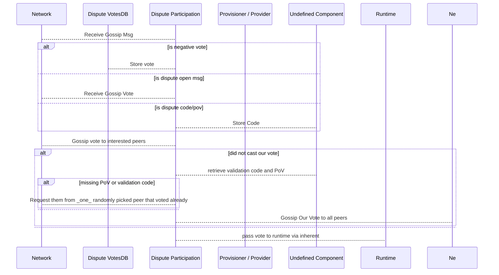
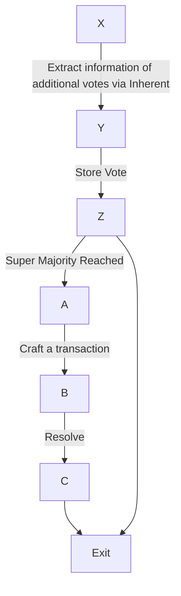
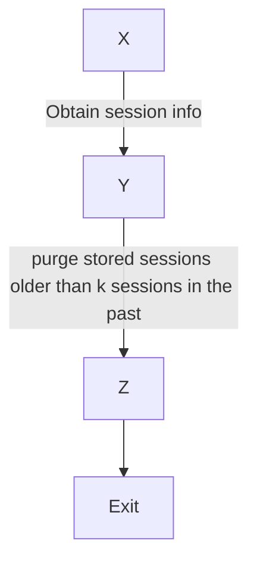

# Dispute Component Partitions

## Understanding fork awareness

There are parts regarding storage. Node side, runtime side and state root persistence.

* Dispute resolution must be persisted in the state-root of each and every fork.
* Dispute resolution.

## Duties

### VotesDB

#### Node

* Stores all cast votes on the node side.
* Allows other subsystems to query disputes
  * by `ValidatorId`
  * by `ValidatorIndex` and `SessionIndex`
  * by `SessionIndex`

* Cleans up votes based on session index

#### StateRoot

Does not interact with the state root.

#### Runtime

Has no interaction with the runtime.

### Participation

#### Node

Receives messages from

* network gossip containing..
  * individual `Vote`s or sets of `Votes`
  * `Code` + `PoV` as a response to such as request
  * a request to another validator (from which a vote was received before) to send `Code` + `PoV` our way

Sends messages

* to the `VotesDB` to ..
  * store `Vote`s
  * query `Vote`s for a particular

* to the network for ..
  * requesting `Code` + `PoV`
  * broadcasting received `Vote`s

* Acts on disputes messages by ..
  * fetching the `PoV` + `Code` blocks
    * running the validation code for the block/candidate

#### Transition Node -> Runtime

* Incoming gossip votes via $mechanics are...
  * stored by sending a message to `VotesDB`
  * passes them on via the proposer/inherents to the runtime

#### Runtime

* incoming message via proposer/inherents are
  * stored them within the runtime (not the state root!)
  * decided upon set of stored votes for the particular dispute
  * decided upon set of stored votes if the dispute is concluded
  * starts the timeout for cleanup of persisted data

### Proposer

#### Node

* Tracks closed disputes
  * transplants them on newly appearing forks without it

* Keep votes around for lt 24 h after block inclusion
Cleanup: whenever

---
## Node

TODO: define interested peers

TODO: describe transplantation duty of proposer/provisioner
## Runtime

The sequential flow of the runtime logic

