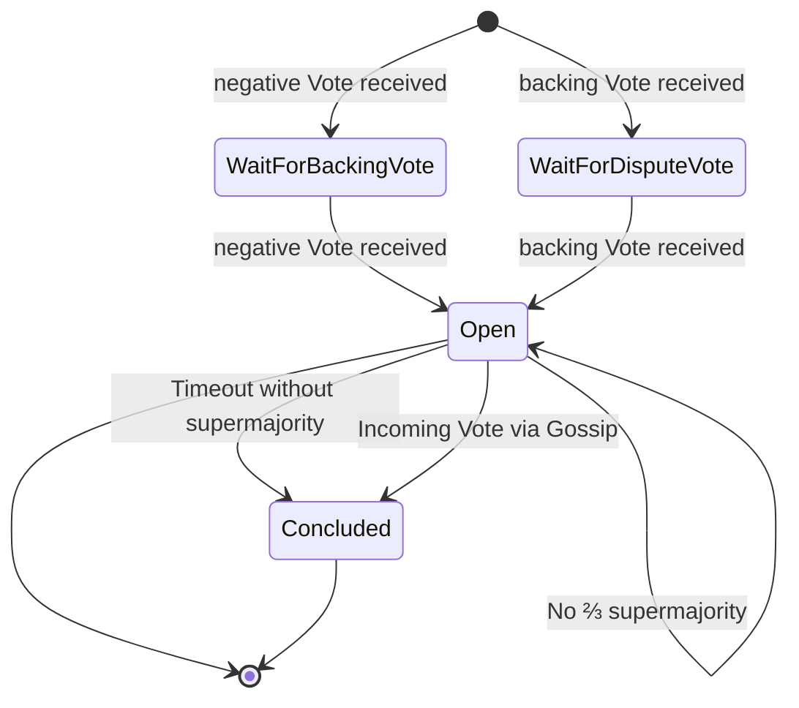
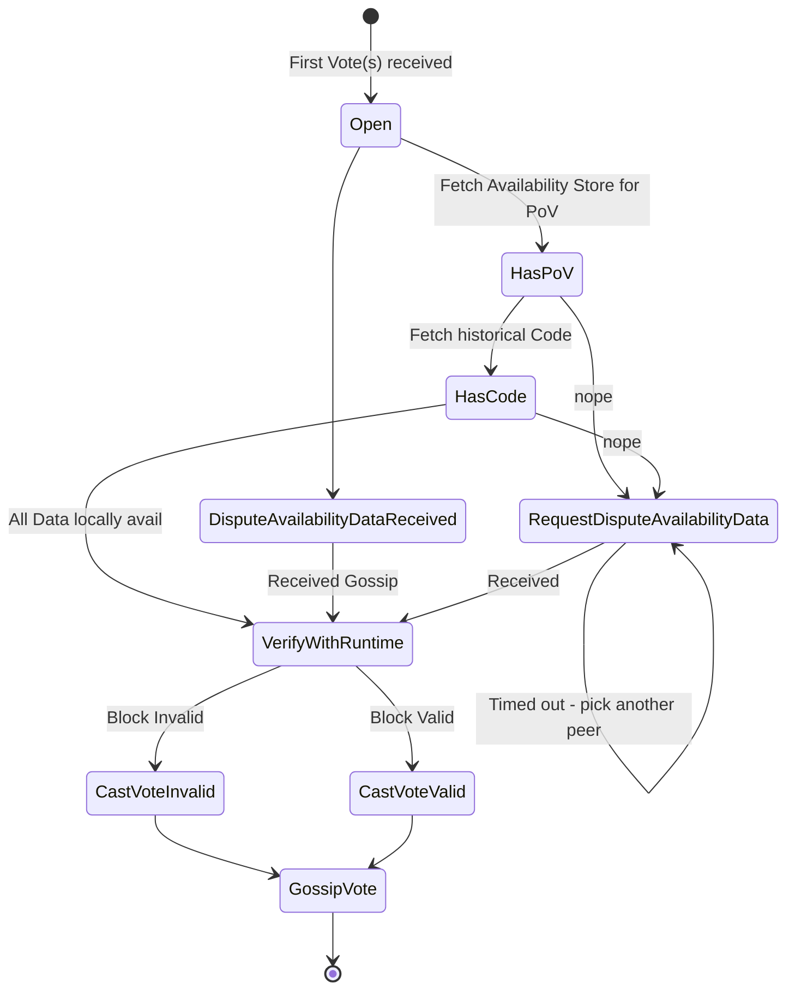
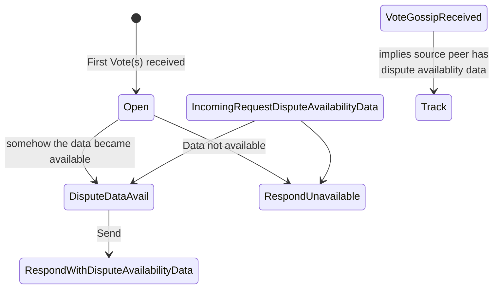
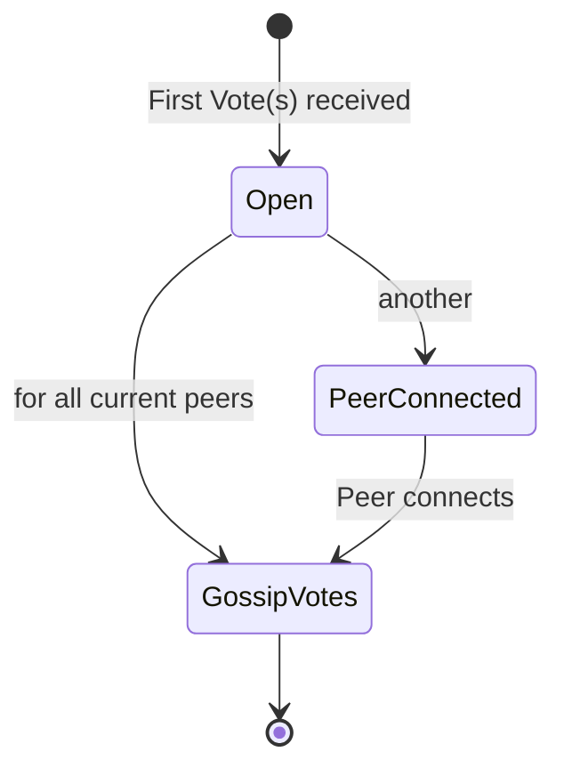

# Disputes Flows

A component-free description in what-if form with addition state graphs of the dispute.

---

---

Dispute Availability Data

---

Peer handling

## Conditional formulation

The set of validators eligible to vote consists of
the validators that had duty at the time of backing, plus backing votes by the backing validators.

If a validator receives an initial dispute message (a set of votes where there are at least two opposing votes contained), and the PoV or Code are hence not reconstructable from local storage, that validator must request the required data from its peers.

The dispute availability message must contain code, persisted validation data, and the proof of validity.

Only peers that already voted shall be queried for the dispute availability data.

The peer to be queried for disputes data, must be picked at random.

A validator must retain code, persisted validation data and PoV until a block, that contains the dispute resolution, is finalized - plus an additional 24h.

Dispute availability gossip must continue beyond the dispute resolution, until the post resolution timeout expired (equiv to the timeout until which additional late votes are accepted).

Remote disputes are disputes that are in relation to a chain that is not part of the local validators active heads.

All incoming votes must be persisted.

Persisted votes stay persisted for `N` sessions, and are cleaned up on a per session basis.

Votes must be queryable by a particular validator, identified by its signing key.

Votes must be queryable by a particular validator, identified by a session index and the validator index valid in that session.

If there exists a negative and a positive fork for a particular block, a dispute is detected.

If a dispute is detected, all currently available votes for that block must be gossiped.

If an incoming dispute vote is detected, a validator must cast their own vote. The vote is determined by validating the PoV with the Code at the time of backing the block in question.

If the validator was also a backer of the block, validation and casting an additional vote should be skipped.

If the count of votes pro or cons regarding the disputed block, reaches the required ⅔ supermajority (including the backing votes), the conclusion must be recorded on chain and the voters on the loosing and no-shows being slashed appropriately.

If a block is found invalid by a dispute resolution, it must be blacklisted to avoid resync or further build on that chain if other chains are available (to be detailed in the grandpa fork choice rule).

A dispute accepts Votes after the dispute is resolved, for 1d.

If a vote is received, after the dispute is resolved, the vote shall still be recorded in the state root, albeit yielding less reward.

Recording in the state root might happen batched, at timeout expiry.

If a new active head/chain appears, and the dispute resolution was not recorded on that chain yet, the dispute resolution or open dispute must be recorded / transplanted to that chain as well, since the disputes must be present on all chains to make sure the offender is punished.

If a validator votes in two opposing ways, this composes of a double vote like in other cases (backing, approval voting).

If a dispute is not resolved within due time, all validators are to be slashed for a small amount.

If a dispute is not resolved within due time, governance mode shall be entered for manual resolution.

If a validator unexpectedly restarts, the dispute shall be continued with the state based on votes being cast and being present in persistent storage.
