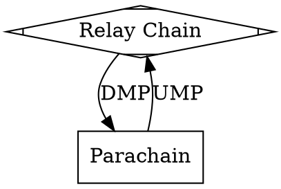
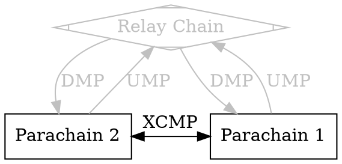

# Messaging Overview

The Polkadot Host has a few mechanisms that are responsible for message passing. They can be generally divided
on two categories: Horizontal and Vertical. Horizontal Message Passing (HMP) refers to mechanisms
that are responsible for exchanging messages between parachains. Vertical Message Passing (VMP) is
used for communication between the relay chain and parachains.

## Vertical Message Passing

Downward Message Passing (DMP) is a mechanism for delivering messages to parachains from the relay chain.

Each parachain has its own queue that stores all pending inbound downward messages. A parachain
doesn't have to process all messages at once, however, there are rules as to how the downward message queue
should be processed. Currently, at least one message must be consumed per candidate if the queue is not empty.
The downward message queue doesn't have a cap on its size and it is up to the relay-chain to put mechanisms
that prevent spamming in place.

Upward Message Passing (UMP) is a mechanism responsible for delivering messages in the opposite direction:
from a parachain up to the relay chain. Upward messages can serve different purposes and can be of different
 kinds.

One kind of message is `Dispatchable`. They could be thought of similarly to extrinsics sent to a relay chain: they also
invoke exposed runtime entrypoints, they consume weight and require fees. The difference is that they originate from
a parachain. Each parachain has a queue of dispatchables to be executed. There can be only so many dispatchables at a time.
The weight that processing of the dispatchables can consume is limited by a preconfigured value. Therefore, it is possible
that some dispatchables will be left for later blocks. To make the dispatching more fair, the queues are processed turn-by-turn
in a round robin fashion.

Upward messages are also used by a parachain to request opening and closing HRMP channels (HRMP will be described below).

Other kinds of upward messages can be introduced in the future as well. Potential candidates are
new validation code signalling, or other requests to the relay chain.

## Horizontal Message Passing

### Cross-Chain Message Passing

The most important member of this family is XCMP.

> ℹ️ XCMP is currently under construction and details are subject for change.

XCMP is a message passing mechanism between parachains that require minimal involvement of the relay chain.
The relay chain provides means for sending parachains to authenticate messages sent to recipient parachains.

Semantically communication occurs through so called channels. A channel is unidirectional and it has
two endpoints, for sender and for recipient. A channel can be opened only if the both parties agree
and closed unilaterally.

Only the channel metadata is stored on the relay-chain in a very compact form: all messages and their
contents sent by the sender parachain are encoded using only one root hash. This root is referred as
MQC head.

The authenticity of the messages must be proven using that root hash to the receiving party at the
candidate authoring time. The proof stems from the relay parent storage that contains the root hash of the channel.
Since not all messages are required to be processed by the receiver's candidate, only the processed
messages are supplied (i.e. preimages), rest are provided as hashes.

Further details can be found at the official repository for the
[Cross-Consensus Message Format (XCM)](https://github.com/paritytech/xcm-format/blob/master/README.md), as well as
at the [W3F research website](https://research.web3.foundation/en/latest/polkadot/XCMP.html) and
[this blogpost](https://medium.com/web3foundation/polkadots-messaging-scheme-b1ec560908b7).

HRMP (Horizontally Relay-routed Message Passing) is a stop gap that predates XCMP. Semantically, it mimics XCMP's interface.
The crucial difference from XCMP though is that all the messages are stored in the relay-chain storage. That makes
things simple but at the same time that makes HRMP more demanding in terms of resources thus making it more expensive.

Once XCMP is available we expect to retire HRMP.
