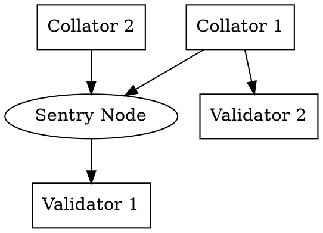
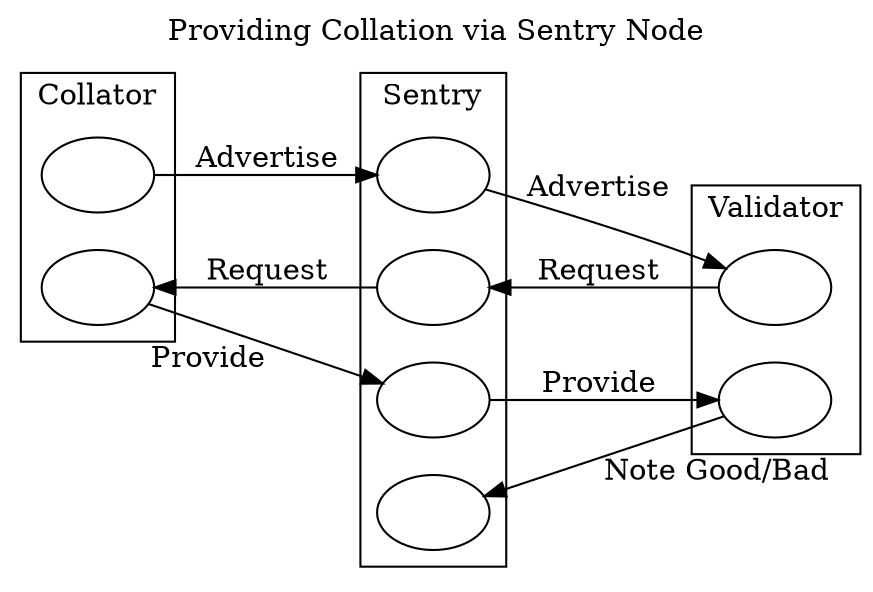

# Collator Protocol

The Collator Protocol implements the network protocol by which collators and validators communicate. It is used by collators to distribute collations to validators and used by validators to accept collations by collators.

Collator-to-Validator networking is more difficult than Validator-to-Validator networking because the set of possible collators for any given para is unbounded, unlike the validator set. Validator-to-Validator networking protocols can easily be implemented as gossip because the data can be bounded, and validators can authenticate each other by their `PeerId`s for the purposes of instantiating and accepting connections.

Since, at least at the level of the para abstraction, the collator-set for any given para is unbounded, validators need to make sure that they are receiving connections from capable and honest collators and that their bandwidth and time are not being wasted by attackers. Communicating across this trust-boundary is the most difficult part of this subsystem.

Validation of candidates is a heavy task, and furthermore, the [`PoV`][PoV] itself is a large piece of data. Empirically, `PoV`s are on the order of 10MB.

> TODO: note the incremental validation function Ximin proposes at https://github.com/paritytech/polkadot/issues/1348

As this network protocol serves as a bridge between collators and validators, it communicates primarily with one subsystem on behalf of each. As a collator, this will receive messages from the [`CollationGeneration`][CG] subsystem. As a validator, this will communicate with the [`CandidateBacking`][CB] subsystem.

## Protocol

Input: [`CollatorProtocolMessage`][CPM]

Output:
  - [`RuntimeApiMessage`][RAM]
  - [`NetworkBridgeMessage`][NBM]

## Functionality

```rust
type RequestId = u64;

/// A message to our guarded validator, when acting as a sentry node.
enum ToOurValidatorMessage {
	/// Forward an advertised collation to our validator.
	AdvertisedCollation(Hash, CollatorId, ParaId),
	/// A requested collation. `None` if the collator didn't provide it.
	RequestedCollation(RequestId, Hash, Option<(CandidateReceipt, PoV)>),
}

/// A message to our sentry node, when a validator.
enum ToOurSentryMessage {
	/// Request a collation of the specific collator/validator pair via the
	/// sentry.
	RequestCollation(RequestId, Hash, CollatorId, ParaId),
	/// Blacklist a collator and the peer representing it.
	BlacklistCollator(CollatorId),
	/// Note a good collation from a collator.
	NoteGoodCollation(CollatorId),
}

enum WireMessage {
	/// A wire message to our validator.
	ToOurValidator(ToOurValidatorMessage),
	/// A wire message to our sentry.
	ToOurSentry(ToOurSentryMessage),

	/// Declare the intent to advertise collations under a collator ID.
	Declare(CollatorId),
	/// Advertise a collation to a validator. Can only be sent once the peer has declared
	/// that they are a collator with given ID.
	AdvertiseCollation(Hash, ParaId),
	/// Request the advertised collation at that relay-parent.
	RequestCollation(RequestId, Hash, ParaId),
	/// A requested collation.
	Collation(RequestId, CandidateReceipt, PoV),
}
```

One of the main necessities of this protocol is to deal with the validator/sentry node duality. Validators aren't expected to expose their node to public connections and instead expose sentry nodes on their behalf. These sentry nodes serve as relays, with protocol-level validation being done to prevent spam.

Since this protocol functions both for validators and collators, it is easiest to go through the protocol actions for each of them separately.

Validators, Collators, and sentry nodes:


### Collators

It is assumed that collators are only collating on a single parachain. Collations are generated by the [Collation Generation][CG] subsystem. We will keep up to one local collation per relay-parent, based on `DistributeCollation` messages. If the para is not scheduled or next up on any core, at the relay-parent, or the relay-parent isn't in the active-leaves set, we ignore the message as it must be invalid in that case - although this indicates a logic error elsewhere in the node.

We keep track of the Para ID we are collating on as a collator. This starts as `None`, and is updated with each `CollateOn` message received. If the `ParaId` of a collation requested to be distributed does not match the one we expect, we ignore the message.

As with most other subsystems, we track the active leaves set by following `ActiveLeavesUpdate` signals.

For the purposes of actually distributing a collation, we need to be connected to the validators who are interested in collations on that `ParaId` at this point in time or sentry nodes that represent them. We assume that there is a discovery API for connecting to a set of validators.

> TODO: design & expose the discovery API not just for connecting to such peers but also to determine which of our current peers are validators.

As seen in the [Scheduler Module][SCH] of the runtime, validator groups are fixed for an entire session and their rotations across cores are predictable. Collators will want to do these things when attempting to distribute collations at a given relay-parent:
  * Determine which core the para collated-on is assigned to.
  * Determine the group on that core and the next group on that core.
  * Issue a discovery request for the validators of the current group and the next group.

Once connected to the relevant peers for the current group assigned to the core (transitively, the para), advertise the collation to any of them which advertise the relay-parent in their view (as provided by the [Network Bridge][NB]). If any respond with a request for the full collation, provide it. Upon receiving a view update from any of these peers which includes a relay-parent for which we have a collation that they will find relevant, advertise the collation to them if we haven't already.

### Validators and Sentry Nodes

Validators are not required to run with sentry nodes, so the code here needs to handle both the case where we run with and without.

One of the main challenges of running with a sentry node is making sure that the state of the sentry is synchronized with the state of the validator node. We use `View` updates for that purpose. Sentry nodes are responsible for forwarding advertisements, requests, and responses to peers.



At any step in the above diagram, the sentry node will be doing validation of the network statements sent by the collator and can report or disconnect the collator.

When peers connect to us, they can `Declare` that they represent a collator with given public key. Once they've declared that, they can begin to send advertisements of collations. The peers should not send us any advertisements for collations that are on a relay-parent outside of our view.

The protocol tracks advertisements received and the source of the advertisement. The advertisement source is either `Direct(PeerId)` or `Sentry(PeerId)`. We accept one advertisement per collator per source per relay-parent.

If we're a sentry node, we relay advertisements to our guarded validator, but only those which reference a relay-parent in both our and our validator's view. This means that when we get a view update from our validator, we may need to forward it advertisements.

If we're a validator, we will receive advertisements from all of our sentries. Although it's not expected, we may also receive advertisements directly from connected peers. This may occur when we are connected to a collator as a reserved peer.

As a validator, we will handle requests from other subsystems to fetch a collation on a specific `ParaId` and relay-parent. These requests are made with the [`CollatorProtocolMessage`][CPM]`::FetchCollation`. To do so, we need to first check if we have already gathered a collation on that `ParaId` and relay-parent. If not, we need to select one of the advertisements and issue a request for it. If we've already issued a request, we shouldn't issue another one until the first has returned.

The type of request we issue depends on the source of the advertisement. The advertisement may have a `Direct` source, in which case we issue a `WireMessage::RequestCollation`, or it may have a `Sentry` source, in which case we issue a `WireMessage::ToOurSentry::RequestCollation`. If the request times out, we need to note the collator as being unreliable and reduce its priority relative to other collators. And then make another request - until we get a response.

If we receive a `ToOurSentry::RequestCollation` as a sentry, we need to act as a proxy and issue a request to the peer who made the particular advertisement being referenced. If it times out or the peer disconnects or sends invalid data, we need to respond to our validator with `ToOurValidator::RequestedCollation(..., None)`. If the request comes from a peer who is not our validator, we need to report and disconnect the peer, as this is a clear breach of protocol.

As a validator, once the collation has been fetched some other subsystem will inspect and do deeper validation of the collation. The subsystem will report to this subsystem with a [`CollatorProtocolMessage`][CPM]`::ReportCollator` or `NoteGoodCollation` message. In that case, if we are connected directly to the collator, we apply a cost to the `PeerId` associated with the collator. Otherwise, if we're connected to the collator via a sentry node, we issue a `ToOurSentryMesage` of the corresponding type. As the recipient of such a message on a sentry node, we carry out the requisite action. When handling a report that a collator is bad, we'd want to cancel all requests to that collator.

### Validator and Sentry nodes: Practicalities

> Note: everything below this point is tentative and subject to change.

We use the `NetworkBridgeUpdate::OurViewChange` to track which heads we consider in our active leaves set and have communicated to peers. We ensure we keep records for all active leaves, mutating based on incoming `ActiveLeavesUpdate`s. The records have this form:

```rust
struct CollationAdvertisements {
	received_advertisements: Set<(Collator, Source)>,
	advertisements: Map<ParaId, Map<Collator, [Source]>>>,
}
```

We also keep a record of what we are fetching for each leaf/relay-parent:

```rust
struct CollationFetch {
	// Fetch requests from subsystems
	fetch_requests: Map<ParaId, FetchState>,
	fetch_inflight: Map<RequestId, (FetchMetadata, [FetchDest])>,
	fetched_candidates: Map<FetchMetadata, (CandidateReceipt, PoV)>,
}

enum FetchState {
	Pending([fn(CandidateReceipt, PoV)]),
	Inflight(RequestId),
	Completed(Collator, Source),
}

struct FetchMetadata {
	Collator,
	Source,
	ParaId,
}

enum FetchDest {
	Subsystem(fn(CandidateReceipt, PoV)),
	Validator(RequestId, PeerId),
}
```

We also keep a record per-peer:

```rust
struct PeerData {
	role: ObservedRole,
	live_requests: Map<RequestId, Hash>, // relay-parent the request is under.
	collator_id: Option<CollatorId>,
	view: View,
}
```

[PoV]: ../../types/availability.md#proofofvalidity
[CPM]: ../../types/overseer-protocol.md#collatorprotocolmessage
[CG]: collation-generation.md
[CB]: ../backing/candidate-backing.md
[NB]: ../utility/network-bridge.md
[CBM]: ../../types/overseer-protocol.md#candidatebackingmesage
[RAM]: ../../types/overseer-protocol.md#runtimeapimessage
[NBM]: ../../types/overseer-protocol.md#networkbridgemessage
[SCH]: ../../runtime/scheduler.md
