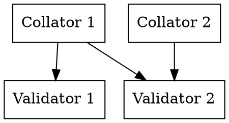
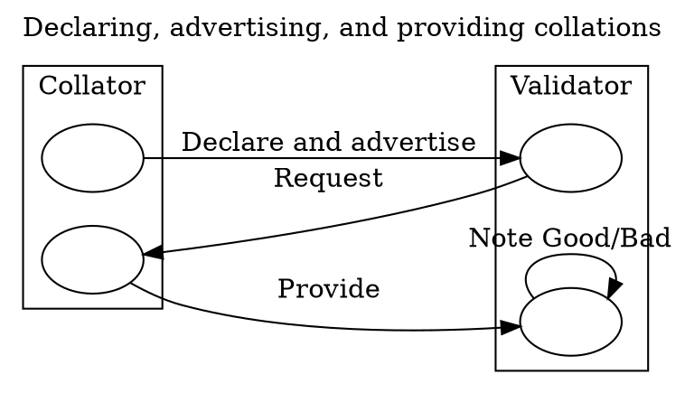

# Collator Protocol

The Collator Protocol implements the network protocol by which collators and validators communicate. It is used by collators to distribute collations to validators and used by validators to accept collations by collators.

Collator-to-Validator networking is more difficult than Validator-to-Validator networking because the set of possible collators for any given para is unbounded, unlike the validator set. Validator-to-Validator networking protocols can easily be implemented as gossip because the data can be bounded, and validators can authenticate each other by their `PeerId`s for the purposes of instantiating and accepting connections.

Since, at least at the level of the para abstraction, the collator-set for any given para is unbounded, validators need to make sure that they are receiving connections from capable and honest collators and that their bandwidth and time are not being wasted by attackers. Communicating across this trust-boundary is the most difficult part of this subsystem.

Validation of candidates is a heavy task, and furthermore, the [`PoV`][PoV] itself is a large piece of data. Empirically, `PoV`s are on the order of 10MB.

> TODO: note the incremental validation function Ximin proposes at https://github.com/paritytech/polkadot/issues/1348

As this network protocol serves as a bridge between collators and validators, it communicates primarily with one subsystem on behalf of each. As a collator, this will receive messages from the [`CollationGeneration`][CG] subsystem. As a validator, this will communicate with the [`CandidateBacking`][CB] and [`CandidateSelection`][CS] subsystems.

## Protocol

Input: [`CollatorProtocolMessage`][CPM]

Output:

- [`RuntimeApiMessage`][RAM]
- [`NetworkBridgeMessage`][NBM]
- [`CandidateSelectionMessage`][CSM]

## Functionality

This network protocol uses the `Collation` peer-set of the [`NetworkBridge`][NB].

It uses the [`CollatorProtocolV1Message`](../../types/network.md#collator-protocol) as its `WireMessage`

Since this protocol functions both for validators and collators, it is easiest to go through the protocol actions for each of them separately.

Validators and collators.

### Collators

It is assumed that collators are only collating on a single parachain. Collations are generated by the [Collation Generation][CG] subsystem. We will keep up to one local collation per relay-parent, based on `DistributeCollation` messages. If the para is not scheduled or next up on any core, at the relay-parent, or the relay-parent isn't in the active-leaves set, we ignore the message as it must be invalid in that case - although this indicates a logic error elsewhere in the node.

We keep track of the Para ID we are collating on as a collator. This starts as `None`, and is updated with each `CollateOn` message received. If the `ParaId` of a collation requested to be distributed does not match the one we expect, we ignore the message.

As with most other subsystems, we track the active leaves set by following `ActiveLeavesUpdate` signals.

For the purposes of actually distributing a collation, we need to be connected to the validators who are interested in collations on that `ParaId` at this point in time. We assume that there is a discovery API for connecting to a set of validators.

As seen in the [Scheduler Module][SCH] of the runtime, validator groups are fixed for an entire session and their rotations across cores are predictable. Collators will want to do these things when attempting to distribute collations at a given relay-parent:
  * Determine which core the para collated-on is assigned to.
  * Determine the group on that core and the next group on that core.
  * Issue a discovery request for the validators of the current group and the next group with[`NetworkBridgeMessage`][NBM]`::ConnectToValidators`.

Once connected to the relevant peers for the current group assigned to the core (transitively, the para), advertise the collation to any of them which advertise the relay-parent in their view (as provided by the [Network Bridge][NB]). If any respond with a request for the full collation, provide it. Upon receiving a view update from any of these peers which includes a relay-parent for which we have a collation that they will find relevant, advertise the collation to them if we haven't already.

### Validators

On the validator side of the protocol, validators need to accept incoming connections from collators. They should keep some peer slots open for accepting new speculative connections from collators and should disconnect from collators who are not relevant.

When peers connect to us, they can `Declare` that they represent a collator with given public key and intend to collate on a specific para ID. Once they've declared that, and we checked their signature, they can begin to send advertisements of collations. The peers should not send us any advertisements for collations that are on a relay-parent outside of our view or for a para outside of the one they've declared.

The protocol tracks advertisements received and the source of the advertisement. The advertisement source is the `PeerId` of the peer who sent the message. We accept one advertisement per collator per source per relay-parent.

As a validator, we will handle requests from other subsystems to fetch a collation on a specific `ParaId` and relay-parent. These requests are made with the request response protocol `CollationFetchingRequest` request. To do so, we need to first check if we have already gathered a collation on that `ParaId` and relay-parent. If not, we need to select one of the advertisements and issue a request for it. If we've already issued a request, we shouldn't issue another one until the first has returned.

When acting on an advertisement, we issue a `Requests::CollationFetching`. If the request times out, we need to note the collator as being unreliable and reduce its priority relative to other collators.

As a validator, once the collation has been fetched some other subsystem will inspect and do deeper validation of the collation. The subsystem will report to this subsystem with a [`CollatorProtocolMessage`][CPM]`::ReportCollator` or `NoteGoodCollation` message. In that case, if we are connected directly to the collator, we apply a cost to the `PeerId` associated with the collator and potentially disconnect or blacklist it.

### Interaction with [Candidate Selection][CS]

As collators advertise the availability, we notify the Candidate Selection subsystem with a [`CandidateSelection`][CSM]`::Collation` message. Note that this message is lightweight: it only contains the relay parent, para id, and collator id.

At that point, the Candidate Selection algorithm is free to use an arbitrary algorithm to determine which if any of these messages to follow up on. It is expected to use the [`CollatorProtocolMessage`][CPM]`::FetchCollation` message to follow up.

The intent behind this design is to minimize the total number of (large) collations which must be transmitted.

[CB]: ../backing/candidate-backing.md
[CBM]: ../../types/overseer-protocol.md#candidate-backing-mesage
[CG]: collation-generation.md
[CPM]: ../../types/overseer-protocol.md#collator-protocol-message
[CS]: ../backing/candidate-selection.md
[CSM]: ../../types/overseer-protocol.md#candidate-selection-message
[NB]: ../utility/network-bridge.md
[NBM]: ../../types/overseer-protocol.md#network-bridge-message
[PoV]: ../../types/availability.md#proofofvalidity
[RAM]: ../../types/overseer-protocol.md#runtime-api-message
[SCH]: ../../runtime/scheduler.md
