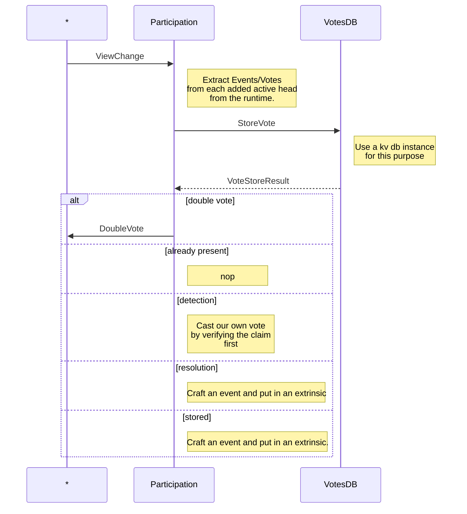

# Disputes

Handles everything around disputes, ranging from persisting and retrieving
votes to notifications of other peers and subsystems about the resolution
as well as passing on information to the runtime.

`VotesDB` is solely responsible for data persistence in a manner
that allows easy retrieval and evaluates the state of particular
disputes and generates `StoreVoteResult`s.

`Participation` uses runtime `Events` to facilitate information
distribution via the transaction gossip.
As such it queries all `DisputeEvents` on view change
and extracts `Vote`s on which it operates on.

If a new dispute is detected, it does the `PoV` retrieval and verification based on the runtime verification code and notifies
interested parties about double votes.

`Vote`s contributing to a resolved (= quorum + supermajority reached)
are treated equally at this stage and are treated equally on the node side.
The effective differences are only going to become relevant within the
runtime.

what happens in the `disputes` part of the runtime, see [disputes runtime](../../runtime/disputes.md).
