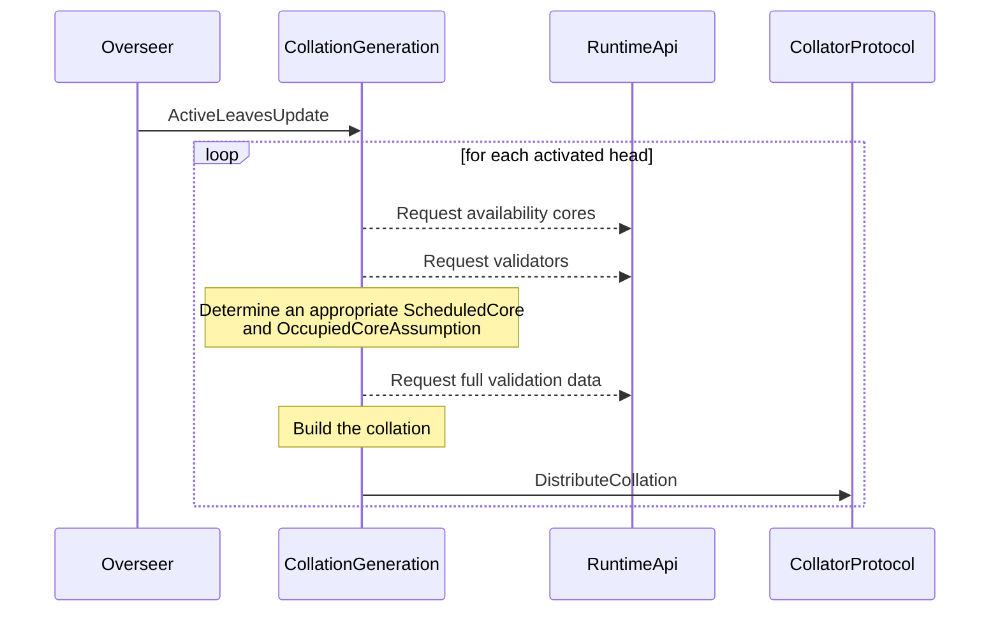
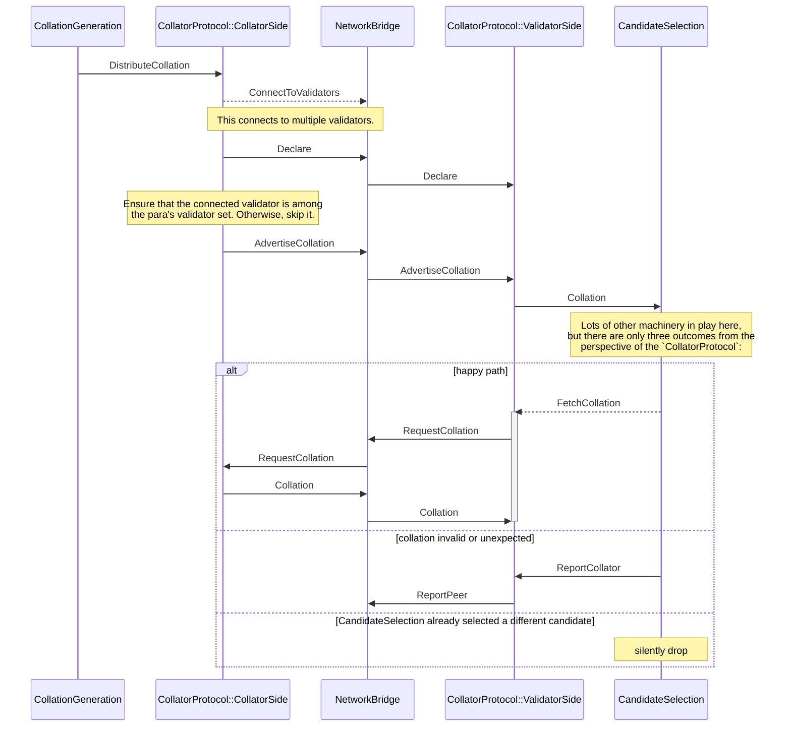
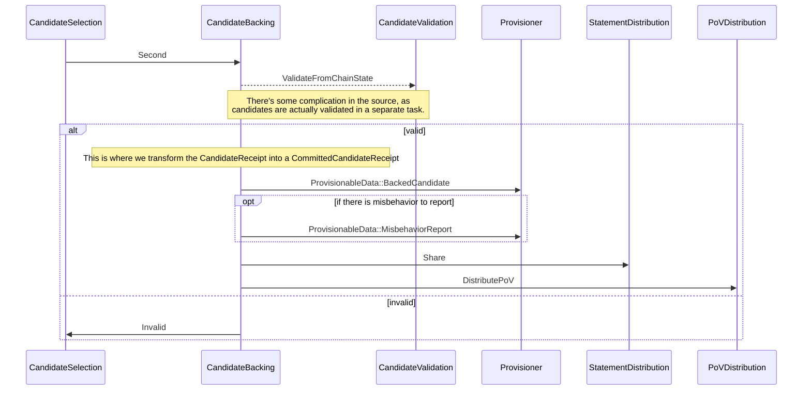
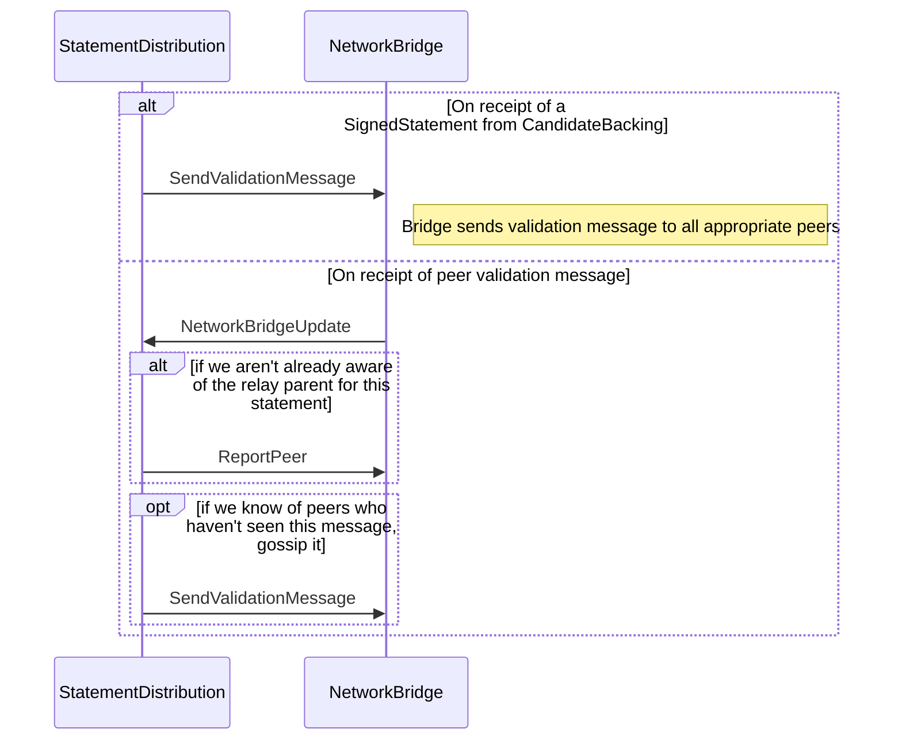
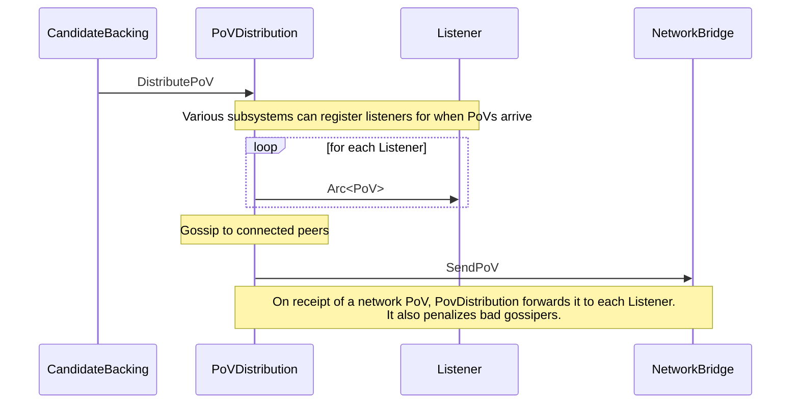
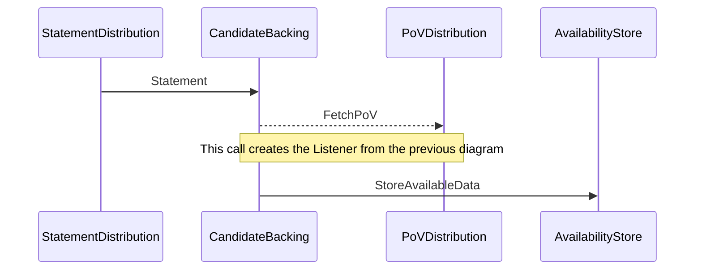
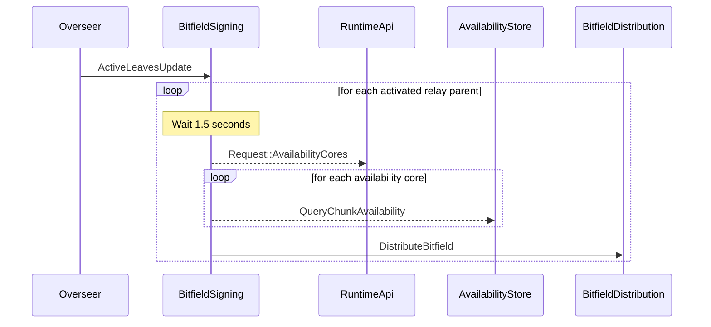
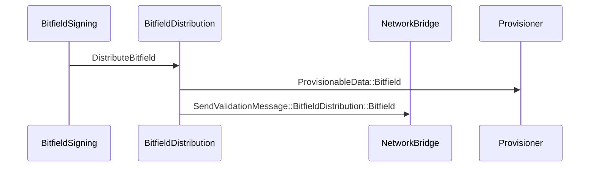
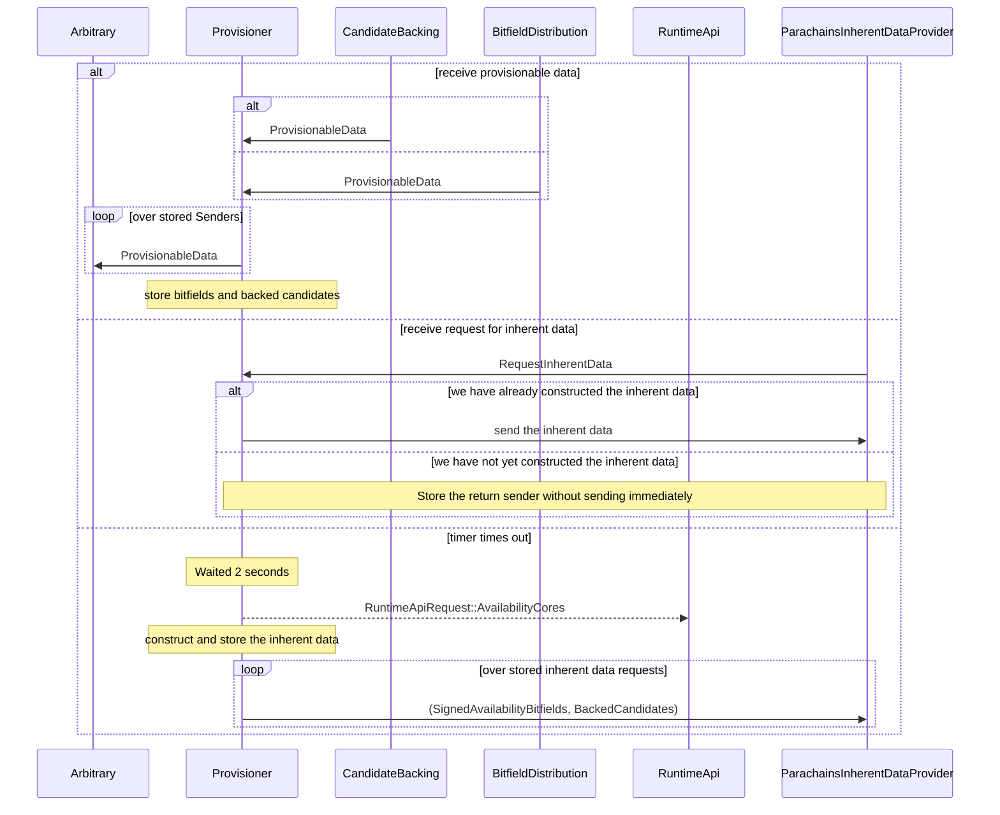

# Subsystems and Jobs

In this section we define the notions of Subsystems and Jobs. These are guidelines for how we will employ an architecture of hierarchical state machines. We'll have a top-level state machine which oversees the next level of state machines which oversee another layer of state machines and so on. The next sections will lay out these guidelines for what we've called subsystems and jobs, since this model applies to many of the tasks that the Node-side behavior needs to encompass, but these are only guidelines and some Subsystems may have deeper hierarchies internally.

Subsystems are long-lived worker tasks that are in charge of performing some particular kind of work. All subsystems can communicate with each other via a well-defined protocol. Subsystems can't generally communicate directly, but must coordinate communication through an [Overseer](overseer.md), which is responsible for relaying messages, handling subsystem failures, and dispatching work signals.

Most work that happens on the Node-side is related to building on top of a specific relay-chain block, which is contextually known as the "relay parent". We call it the relay parent to explicitly denote that it is a block in the relay chain and not on a parachain. We refer to the parent because when we are in the process of building a new block, we don't know what that new block is going to be. The parent block is our only stable point of reference, even though it is usually only useful when it is not yet a parent but in fact a leaf of the block-DAG expected to soon become a parent (because validators are authoring on top of it). Furthermore, we are assuming a forkful blockchain-extension protocol, which means that there may be multiple possible children of the relay-parent. Even if the relay parent has multiple children blocks, the parent of those children is the same, and the context in which those children is authored should be the same. The parent block is the best and most stable reference to use for defining the scope of work items and messages, and is typically referred to by its cryptographic hash.

Since this goal of determining when to start and conclude work relative to a specific relay-parent is common to most, if not all subsystems, it is logically the job of the Overseer to distribute those signals as opposed to each subsystem duplicating that effort, potentially being out of synchronization with each other. Subsystem A should be able to expect that subsystem B is working on the same relay-parents as it is. One of the Overseer's tasks is to provide this heartbeat, or synchronized rhythm, to the system.

The work that subsystems spawn to be done on a specific relay-parent is known as a job. Subsystems should set up and tear down jobs according to the signals received from the overseer. Subsystems may share or cache state between jobs.

Subsystems must be robust to spurious exits. The outputs of the set of subsystems as a whole comprises of signed messages and data committed to disk. Care must be taken to avoid issuing messages that are not substantiated. Since subsystems need to be safe under spurious exits, it is the expected behavior that an `OverseerSignal::Conclude` can just lead to breaking the loop and exiting directly as opposed to waiting for everything to shut down gracefully.

## Subsystem Message Traffic

Which subsystems send messages to which other subsystems.

**Note**: This diagram omits the overseer for simplicity. In fact, all messages are relayed via the overseer.

**Note**: Messages with a filled diamond arrowhead ("♦") include a `oneshot::Sender` which communicates a response from the recipient.
Messages with an open triangle arrowhead ("Δ") do not include a return sender.

## The Path to Inclusion (Node Side)

Let's contextualize that diagram a bit by following a parachain block from its creation through finalization.
Parachains can use completely arbitrary processes to generate blocks. The relay chain doesn't know or care about
the details; each parachain just needs to provide a [collator](collators/collation-generation.md).

**Note**: Inter-subsystem communications are relayed via the overseer, but that step is omitted here for brevity.

**Note**: Dashed lines indicate a request/response cycle, where the response is communicated asynchronously via
a oneshot channel. Adjacent dashed lines may be processed in parallel.

The `DistributeCollation` messages that `CollationGeneration` sends to the `CollatorProtocol` contains
two items: a `CandidateReceipt` and `PoV`. The `CollatorProtocol` is then responsible for distributing
that collation to interested validators. However, not all potential collations are of interest. The
`CandidateSelection` subsystem is responsible for determining which collations are interesting, before
`CollatorProtocol` actually fetches the collation.

Assuming we hit the happy path, flow continues with `CandidateSelection` receiving a `(candidate_receipt, pov)` as
the return value from its
`FetchCollation` request. The only time `CandidateSelection` actively requests a collation is when
it hasn't yet seconded one for some `relay_parent`, and is ready to second.

At this point, you'll see that control flows in two directions: to `StatementDistribution` to distribute
the `SignedStatement`, and to `PoVDistribution` to distribute the `PoV`. However, that's largely a mirage:
while the initial implementation distributes `PoV`s by gossip, that's inefficient, and will be replaced
with a system which fetches `PoV`s only when actually necessary.

> TODO: figure out more precisely the current status and plans; write them up

Therefore, we'll follow the `SignedStatement`. The `StatementDistribution` subsystem is largely concerned
with implementing a gossip protocol:

But who are these `Listener`s who've asked to be notified about incoming `SignedStatement`s?
Nobody, as yet.

Let's pick back up with the PoV Distribution subsystem.

Unlike in the case of `StatementDistribution`, there is another subsystem which in various circumstances
already registers a listener to be notified when a new `PoV` arrives: `CandidateBacking`. Note that this
is the second time that `CandidateBacking` has gotten involved. The first instance was from the perspective
of the validator choosing to second a candidate via its `CandidateSelection` subsystem. This time, it's
from the perspective of some other validator, being informed that this foreign `PoV` has been received.

At this point, things have gone a bit nonlinear. Let's pick up the thread again with `BitfieldSigning`. As
the `Overseer` activates each relay parent, it starts a `BitfieldSigningJob` which operates on an extremely
simple metric: after creation, it immediately goes to sleep for 1.5 seconds. On waking, it records the state
of the world pertaining to availability at that moment.

`BitfieldDistribution` is, like the other `*Distribution` subsystems, primarily interested in implementing
a peer-to-peer gossip network propagating its particular messages. However, it also serves as an essential
relay passing the message along.

We've now seen the message flow to the `Provisioner`: both `CandidateBacking` and `BitfieldDistribution`
contribute provisionable data. Now, let's look at that subsystem.

Much like the `BitfieldSigning` subsystem, the `Provisioner` creates a new job for each newly-activated
leaf, and starts a timer. Unlike `BitfieldSigning`, we won't depict that part of the process, because
the `Provisioner` also has other things going on.

In principle, any arbitrary subsystem could send a `RequestInherentData` to the `Provisioner`. In practice,
only the `ParachainsInherentDataProvider` does so.

The tuple `(SignedAvailabilityBitfields, BackedCandidates, ParentHeader)` is injected by the `ParachainsInherentDataProvider`
into the inherent data. From that point on, control passes from the node to the runtime.
