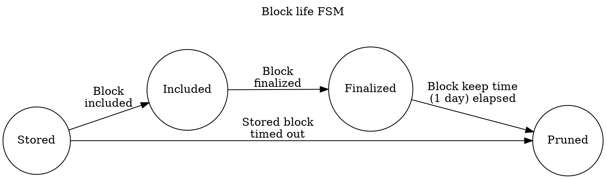
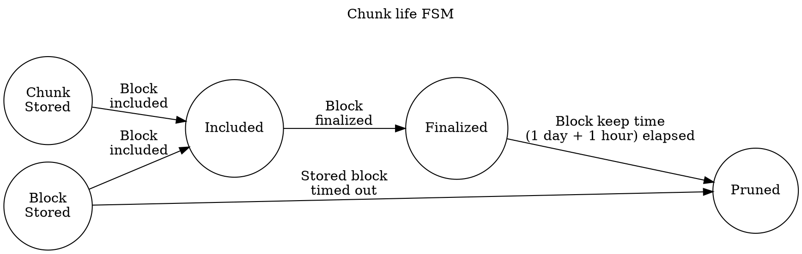

# Availability Store

This is a utility subsystem responsible for keeping available certain data and pruning that data.

The two data types:

- Full PoV blocks of candidates we have validated
- Availability chunks of candidates that were backed and noted available on-chain.

For each of these data we have pruning rules that determine how long we need to keep that data available.

PoV hypothetically only need to be kept around until the block where the data was made fully available is finalized. However, disputes can revert finality, so we need to be a bit more conservative. We should keep the PoV until a block that finalized availability of it has been finalized for 1 day.

> TODO: arbitrary, but extracting `acceptance_period` is kind of hard here...

Availability chunks need to be kept available until the dispute period for the corresponding candidate has ended. We can accomplish this by using the same criterion as the above, plus a delay. This gives us a pruning condition of the block finalizing availability of the chunk being final for 1 day + 1 hour.

> TODO: again, concrete acceptance-period would be nicer here, but complicates things

There is also the case where a validator commits to make a PoV available, but the corresponding candidate is never backed. In this case, we keep the PoV available for 1 hour.

> TODO: ideally would be an upper bound on how far back contextual execution is OK.

There may be multiple competing blocks all ending the availability phase for a particular candidate. Until (and slightly beyond) finality, it will be unclear which of those is actually the canonical chain, so the pruning records for PoVs and Availability chunks should keep track of all such blocks.

## Lifetime of the PoV in the storage

## Lifetime of the chunk in the storage

## Protocol

Input: [`AvailabilityStoreMessage`][ASM]

Output:
- [`RuntimeApiMessage`][RAM]

## Functionality

On `ActiveLeavesUpdate`:

For each head in the `activated` list:
	- Note any new candidates backed in the block. Update pruning records for any stored `PoVBlock`s.
	- Note any newly-included candidates backed in the block. Update pruning records for any stored availability chunks.

On `OverseerSignal::BlockFinalized(_)` events:

- Handle all pruning based on the newly-finalized block.

On `QueryPoV` message:

- Return the PoV block, if any, for that candidate hash.

On `QueryChunk` message:

- Determine if we have the chunk indicated by the parameters and return it and its inclusion proof via the response channel if so.

On `StoreChunk` message:

- Store the chunk along with its inclusion proof under the candidate hash and validator index.

On `StorePoV` message:

- Store the block, if the validator index is provided, store the respective chunk as well.

On finality event:

- For the finalized block and any earlier block (if any) update pruning records of `PoV`s and chunks to keep them for respective periods after finality.

### Note any backed, included and timedout candidates in the block by `hash`.

- Create a `(sender, receiver)` pair.
- Dispatch a [`RuntimeApiMessage`][RAM]`::Request(hash, RuntimeApiRequest::CandidateEvents(sender)` and listen on the receiver for a response.
- For every event in the response:`CandidateEvent::CandidateIncluded`.
  * For every `CandidateEvent::CandidateBacked` do nothing
  * For every `CandidateEvent::CandidateIncluded` update pruning records of any blocks that the node stored previously.
  * For every `CandidateEvent::CandidateTimedOut` use pruning records to prune the data; delete the info from records.

## Schema

### PoV pruning

We keep a record about every PoV we keep, tracking its state and the time after which this PoV should be pruned.

As the state of the `Candidate` changes, so does the `Prune At` time according to the rules defined earlier.

| Record 1       | .. | Record N       |
|----------------|----|----------------|
| CandidateHash1 | .. | CandidateHashN |
|    Prune At    | .. |    Prune At    |
| CandidateState | .. | CandidateState |

### Chunk pruning

Chunk pruning is organized in a similar schema as PoV pruning.

| Record 1       | .. | Record N       |
|----------------|----|----------------|
| CandidateHash1 | .. | CandidateHashN |
|    Prune At    | .. |    Prune At    |
| CandidateState | .. | CandidateState |

### Included blocks caching

In order to process finality events correctly we need to cache the set of parablocks included into each relay block beginning with the last finalized block and up to the most recent heads. We have to cache this data since we are only able to query this info from the state for the `k` last blocks where `k` is a relatively small number (for more info see `Assumptions`)

These are used to update Chunk pruning and PoV pruning records upon finality:
When another block finality notification is received:
 - For any record older than this block:
   - Update pruning
   - Remove the record

| Relay Block N | .. | Chain Head 1 | Chain Head 2 |
|---------------|----|--------------|--------------|
| CandidateN_1 Included | .. | Candidate1_1 Included | Candidate2_1 Included |
| CandidateN_2 Included | .. | Candidate1_2 Included | Candidete2_2 Included |
|          ..           | .. |          ..           |           ..          |
| CandidateN_M Included | .. | Candidate1_K Included | Candidate2_L Included |

> TODO: It's likely we will have to have a way to go from block hash to `BlockNumber` to make this work.

### Blocks

Blocks are simply stored as `(Hash, AvailableData)` key-value pairs.

### Chunks

Chunks are stored as `(Hash, Vec<ErasureChunk>)` key-value pairs.

## Basic scenarios to test

Basically we need to test the correctness of data flow through state FSMs described earlier. These tests obviously assume that some mocking of time is happening.

- Stored data that is never included pruned in necessary timeout
  - A block (and/or a chunk) is added to the store.
  - We never note that the respective candidate is included.
  - Until a defined timeout the data in question is available.
  - After this timeout the data is no longer available.

- Stored data is kept until we are certain it is finalized.
  - A block (and/or a chunk) is added to the store.
  - It is available.
  - Before the inclusion timeout expires notify storage that the candidate was included.
  - The data is still available.
  - Wait for an absurd amount of time (longer than 1 day).
  - Check that the data is still available.
  - Send finality notification about the block in question.
  - Wait for some time below finalized data timeout.
  - The data is still available.
  - Wait until the data should have been pruned.
  - The data is no longer available.

- Forkfulness of the relay chain is taken into account
  - Block `B1` is added to the store.
  - Block `B2` is added to the store.
  - Notify the subsystem that both `B1` and `B2` were included in different leafs of relay chain.
  - Notify the subsystem that the leaf with `B1` was finalized.
  - Leaf with `B2` is never finalized.
  - Leaf with `B2` is pruned and its data is no longer available.
  - Wait until the finalized data of `B1` should have been pruned.
  - `B1` is no longer available.

[RAM]: ../../types/overseer-protocol.md#runtime-api-message
[ASM]: ../../types/overseer-protocol.md#availability-store-message
