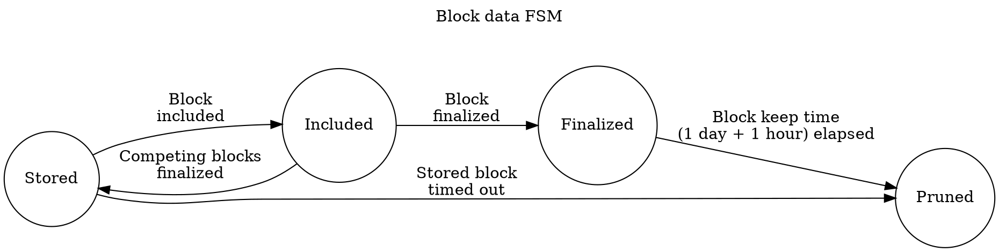

# Availability Store

This is a utility subsystem responsible for keeping available certain data and pruning that data.

The two data types:

- Full PoV blocks of candidates we have validated
- Availability chunks of candidates that were backed and noted available on-chain.

For each of these data we have pruning rules that determine how long we need to keep that data available.

PoV hypothetically only need to be kept around until the block where the data was made fully available is finalized. However, disputes can revert finality, so we need to be a bit more conservative and we add a delay. We should keep the PoV until a block that finalized availability of it has been finalized for 1 day + 1 hour.

Availability chunks need to be kept available until the dispute period for the corresponding candidate has ended. We can accomplish this by using the same criterion as the above. This gives us a pruning condition of the block finalizing availability of the chunk being final for 1 day + 1 hour.

There is also the case where a validator commits to make a PoV available, but the corresponding candidate is never backed. In this case, we keep the PoV available for 1 hour.

There may be multiple competing blocks all ending the availability phase for a particular candidate. Until finality, it will be unclear which of those is actually the canonical chain, so the pruning records for PoVs and Availability chunks should keep track of all such blocks.

## Lifetime of the block data and chunks in storage



## Database Schema

We use an underlying Key-Value database where we assume we have the following operations available:

- `write(key, value)`
- `read(key) -> Option<value>`
- `iter_with_prefix(prefix) -> Iterator<(key, value)>` - gives all keys and values in lexicographical order where the key starts with `prefix`.

We use this database to encode the following schema:

```rust
("available", CandidateHash) -> Option<AvailableData>
("chunk", CandidateHash, u32) -> Option<ErasureChunk>
("meta", CandidateHash) -> Option<CandidateMeta>

("unfinalized", BlockNumber, BlockHash, CandidateHash) -> Option<()>
("prune_by_time", Timestamp, CandidateHash) -> Option<()>
```

Timestamps are the wall-clock seconds since Unix epoch. Timestamps and block numbers are both encoded as big-endian so lexicographic order is ascending.

The meta information that we track per-candidate is defined as the `CandidateMeta` struct

```rust
struct CandidateMeta {
  state: State,
  data_available: bool,
  chunks_stored: Bitfield,
}

enum State {
  /// Candidate data was first observed at the given time but is not available in any block.
  Unavailable(Timestamp),
  /// The candidate was first observed at the given time and was included in the given list of unfinalized blocks, which may be
  /// empty. The timestamp here is not used for pruning. Either one of these blocks will be finalized or the state will regress to
  /// `State::Unavailable`, in which case the same timestamp will be reused.
  Unfinalized(Timestamp, Vec<(BlockNumber, BlockHash)>),
  /// Candidate data has appeared in a finalized block and did so at the given time.
  Finalized(Timestamp)
}
```

We maintain the invariant that if a candidate has a meta entry, its available data exists on disk if `data_available` is true. All chunks mentioned in the meta entry are available.

Additionally, there is exactly one `prune_by_time` entry which holds the candidate hash unless the state is `Unfinalized`. There may be zero, one, or many "unfinalized" keys with the given candidate, and this will correspond to the `state` of the meta entry.

## Protocol

Input: [`AvailabilityStoreMessage`][ASM]

Output:

- [`RuntimeApiMessage`][RAM]

## Functionality

For each head in the `activated` list:

- Load all ancestors of the head back to the finalized block so we don't miss anything if import notifications are missed. If a `StoreChunk` message is received for a candidate which has no entry, then we will prematurely lose the data.
- Note any new candidates backed in the head. Update the `CandidateMeta` for each. If the `CandidateMeta` does not exist, create it as `Unavailable` with the current timestamp. Register a `"prune_by_time"` entry based on the current timestamp + 1 hour.
- Note any new candidate included in the head. Update the `CandidateMeta` for each, performing a transition from `Unavailable` to `Unfinalized` if necessary. That includes removing the `"prune_by_time"` entry. Add the head hash and number to the state, if unfinalized. Add an `"unfinalized"` entry for the block and candidate.
- The `CandidateEvent` runtime API can be used for this purpose.

On `OverseerSignal::BlockFinalized(finalized)` events:

- for each key in `iter_with_prefix("unfinalized")`
  - Stop if the key is beyond `("unfinalized, finalized)`
  - For each block number f that we encounter, load the finalized hash for that block.
    - The state of each `CandidateMeta` we encounter here must be `Unfinalized`, since we loaded the candidate from an `"unfinalized"` key.
    - For each candidate that we encounter under `f` and the finalized block hash,
      - Update the `CandidateMeta` to have `State::Finalized`.  Remove all `"unfinalized"` entries from the old `Unfinalized` state.
      - Register a `"prune_by_time"` entry for the candidate based on the current time + 1 day + 1 hour.
    - For each candidate that we encounter under `f` which is not under the finalized block hash,
      - Remove all entries under `f` in the `Unfinalized` state.
      - If the `CandidateMeta` has state `Unfinalized` with an empty list of blocks, downgrade to `Unavailable` and re-schedule pruning under the timestamp + 1 hour. We do not prune here as the candidate still may be included in a descendant of the finalized chain.
    - Remove all `"unfinalized"` keys under `f`.
- Update `last_finalized` = finalized.

  This is roughly `O(n * m)` where n is the number of blocks finalized since the last update, and `m` is the number of parachains.

On `QueryAvailableData` message:

- Query `("available", candidate_hash)`

  This is `O(n)` in the size of the data, which may be large.

On `QueryDataAvailability` message:

- Query whether `("meta", candidate_hash)` exists and `data_available == true`.

  This is `O(n)` in the size of the metadata which is small.

On `QueryChunk` message:

- Query `("chunk", candidate_hash, index)`

  This is `O(n)` in the size of the data, which may be large.

On `QueryAllChunks` message:

- Query `("meta", candidate_hash)`. If `None`, send an empty response and return.
- For all `1` bits in the `chunks_stored`, query `("chunk", candidate_hash, index)`. Ignore but warn on errors, and return a vector of all loaded chunks.

On `QueryChunkAvailability` message:

- Query whether `("meta", candidate_hash)` exists and the bit at `index` is set.

  This is `O(n)` in the size of the metadata which is small.

On `StoreChunk` message:

- If there is a `CandidateMeta` under the candidate hash, set the bit of the erasure-chunk in the `chunks_stored` bitfield to `1`. If it was not `1` already, write the chunk under `("chunk", candidate_hash, chunk_index)`.

  This is `O(n)` in the size of the chunk.

On `StoreAvailableData` message:

- If there is no `CandidateMeta` under the candidate hash, create it with `State::Unavailable(now)`. Load the `CandidateMeta` otherwise.
- Store `data` under `("available", candidate_hash)` and set `data_available` to true.
- Store each chunk under `("chunk", candidate_hash, index)` and set every bit in `chunks_stored` to `1`.

  This is `O(n)` in the size of the data as the aggregate size of the chunks is proportional to the data.

Every 5 minutes, run a pruning routine:

- for each key in `iter_with_prefix("prune_by_time")`:
  - If the key is beyond `("prune_by_time", now)`, return.
  - Remove the key.
  - Extract `candidate_hash` from the key.
  - Load and remove the `("meta", candidate_hash)`
  - For each erasure chunk bit set, remove `("chunk", candidate_hash, bit_index)`.
  - If `data_available`, remove `("available", candidate_hash)`

  This is O(n * m) in the amount of candidates and average size of the data stored. This is probably the most expensive operation but does not need
  to be run very often.

## Basic scenarios to test

Basically we need to test the correctness of data flow through state FSMs described earlier. These tests obviously assume that some mocking of time is happening.

- Stored data that is never included pruned in necessary timeout
  - A block (and/or a chunk) is added to the store.
  - We never note that the respective candidate is included.
  - Until a defined timeout the data in question is available.
  - After this timeout the data is no longer available.

- Stored data is kept until we are certain it is finalized.
  - A block (and/or a chunk) is added to the store.
  - It is available.
  - Before the inclusion timeout expires notify storage that the candidate was included.
  - The data is still available.
  - Wait for an absurd amount of time (longer than 1 day).
  - Check that the data is still available.
  - Send finality notification about the block in question.
  - Wait for some time below finalized data timeout.
  - The data is still available.
  - Wait until the data should have been pruned.
  - The data is no longer available.

- Fork-awareness of the relay chain is taken into account
  - Block `B1` is added to the store.
  - Block `B2` is added to the store.
  - Notify the subsystem that both `B1` and `B2` were included in different leafs of relay chain.
  - Notify the subsystem that the leaf with `B1` was finalized.
  - Leaf with `B2` is never finalized.
  - Leaf with `B2` is pruned and its data is no longer available.
  - Wait until the finalized data of `B1` should have been pruned.
  - `B1` is no longer available.

[RAM]: ../../types/overseer-protocol.md#runtime-api-message
[ASM]: ../../types/overseer-protocol.md#availability-store-message
