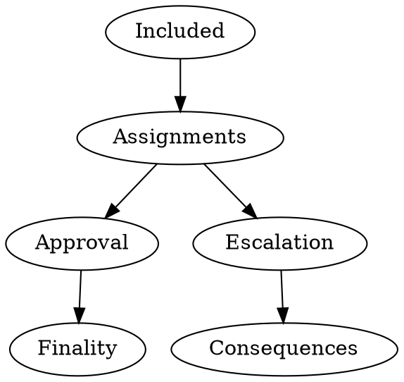

# Approval Process

The Approval Process is the mechanism by which the relay-chain ensures that only valid parablocks are finalized and that backing validators are held accountable for managing to get bad blocks included into the relay chain.

Having a parachain include a bad block into a fork of the relay-chain is not catastrophic as long as the block isn't finalized by the relay-chain's finality gadget, GRANDPA. If the block isn't finalized, that means that the fork of the relay-chain can be reverted in favor of another by means of a dynamic fork-choice rule which leads honest validators to ignore any forks containing that parablock.

Dealing with a bad parablock proceeds in these stages:
1. Detection
2. Escalation
3. Consequences

First, the bad block must be detected by an honest party. Second, the honest party must escalate the bad block to be checked by all validators. And last, the correct consequences of a bad block must occur. The first consequence, as mentioned above, is to revert the chain so what full nodes perceive to be best no longer contains the bad parablock. The second consequence is to slash all malicious validators. Note that, if the chain containing the bad block is reverted, that the result of the dispute needs to be transplanted or at least transplantable to all other forks of the chain so that malicious validators are slashed in all possible histories. Phrased alternatively, there needs to be no possible relay-chain in which malicious validators get away cost-free.

Accepting a parablock is the end result of having passed through the detection stage without dispute, or having passed through the escalation/dispute stage with a positive outcome. For this to work, we need the detection procedure to have the properties that enough honest validators are always selected to check the parablock and that they cannot be interfered with by an adversary. This needs to be balanced with the scaling concern of parachains in general: the easiest way to get the first property is to have everyone check everything, but that is clearly too heavy. So we also have a desired constraint on the other property that we have as few validators as possible check any particular parablock. Our assignment function is the method by which we select validators to do approval checks on parablocks.

It often makes more sense to think of relay-chain blocks as having been approved or not as opposed to thinking about whether parablocks have been approved. A relay-chain block containing a single bad parablock needs to be reverted, and a relay-chain block that contains only approved parablocks can be called approved, as long as its parent relay-chain block is also approved. It is important that the validity of any particular relay-chain block depend on the validity of its ancestry, so we do not finalize a block which has a bad block in its ancestry.

Approval has roughly two parts:

- **Assignments** determines which validators performs approval checks on which candidates.  It ensures that each candidate receives enough random checkers, while reducing adversaries' odds for obtaining enough checkers, and limiting adversaries' foreknowledge.  It tracks approval votes to identify when "no show" approval check takes suspiciously long, perhaps indicating the node being under attack, and assigns more checks in this case.  It tracks relay chain equivocations to determine when adversaries possibly gained foreknowledge about assignments, and adds additional checks in this case.

- **Approval checks** listens to the assignments subsystem for outgoing assignment notices that we shall check specific candidates.  It then performs these checks by first invoking the reconstruction subsystem to obtain the candidate, second invoking the candidate validity utility subsystem upon the candidate, and finally sending out an approval vote, or perhaps initiating a dispute.

These both run first as off-chain consensus protocols using messages gossiped among all validators, and second as an on-chain record of this off-chain protocols' progress after the fact.  We need the on-chain protocol to provide rewards for the off-chain protocol.

Approval requires two gossiped message types, assignment notices created by its assignments subsystem, and approval votes sent by our approval checks subsystem when authorized by the candidate validity utility subsystem.

### Approval keys

We need two separate keys for the approval subsystem:

- **Approval assignment keys** are sr25519/schnorrkel keys used only for the assignment criteria VRFs.  We implicitly sign assignment notices with approval assignment keys by including their relay chain context and additional data in the VRF's extra message, but exclude these from its VRF input.

- **Approval vote keys** would only sign off on candidate parablock validity and has no natural key type restrictions. There's no need for this to actually embody a new session key type. We just want to make a distinction between assignments and approvals, although distant future node configurations might favor separate roles. We re-use the same keys as are used for parachain backing in practice.

Approval vote keys could relatively easily be handled by some hardened signer tooling, perhaps even HSMs assuming we select ed25519 for approval vote keys.  Approval assignment keys might or might not support hardened signer tooling, but doing so sounds far more complex.  In fact, assignment keys determine only VRF outputs that determine approval checker assignments, for which they can only act or not act, so they cannot equivocate, lie, etc. and represent little if any slashing risk for validator operators.

In future, we shall determine which among the several hardening techniques best benefits the network as a whole.  We could provide a multi-process multi-machine architecture for validators, perhaps even reminiscent of GNUNet, or perhaps more resembling smart HSM tooling.  We might instead design a system that more resembled full systems, like like Cosmos' sentry nodes.  In either case, approval assignments might be handled by a slightly hardened machine, but not necessarily nearly as hardened as approval votes, but approval votes machines must similarly run foreign WASM code, which increases their risk, so assignments being separate sounds helpful.

## Assignments

Approval assignment determines on which candidate parachain blocks each validator performs approval checks.  An approval session considers only one relay chain block and assigns only those candidates that relay chain block declares available.

Assignment balances several concerns:

- limits adversaries' foreknowledge about assignments,
- ensures enough checkers, and
- distributes assignments relatively equitably.

Assignees determine their own assignments to check specific candidates using two or three assignment criteria.  Assignees never reveal their assignments until relevant, and gossip delays assignments sent early, which limits others' foreknowledge.  Assignees learn their assignment only with the relay chain block.

All criteria require the validator evaluate a verifiable random function (VRF) using their VRF secret key.  All criteria input specific data called "stories" about the session's relay chain block, and output candidates to check and a precedence called a `DelayTranche`.

We liberate availability cores when their candidate becomes available of course, but one approval assignment criteria continues associating each candidate with the core number it occupied when it became available.

Assignment operates in loosely timed rounds determined by this `DelayTranche`s, which proceed roughly 12 times faster than six second block production assuming half second gossip times.  If a candidate `C` needs more approval checkers by the time we reach round `t` then any validators with an assignment to `C` in delay tranche `t` gossip their send assignment notice for `C`.  We continue until all candidates have enough approval checkers assigned.  We take entire tranches together if we do not yet have enough, so we expect strictly more than enough checkers.  We also take later tranches if some checkers return their approval votes too slow (see no shows below).

Assignment ensures validators check those relay chain blocks for which they have delay tranche zero aka the highest precedence, so that adversaries always face honest checkers equal to the expected number of assignments with delay tranche zero.

Among these criteria, the BABE VRF output provides the story for two, which reduces how frequently adversaries could position their own checkers.  We have one criterion whose story consists of the candidate's block hash plus external knowledge that a relay chain equivocation exists with a conflicting candidate.  It provides unforeseeable assignments when adversaries gain foreknowledge about the other two by committing an equivocation in relay chain block production.

## Announcements / Notices

We gossip assignment notices among nodes so that all validators know which validators should check each candidate, and if any candidate requires more checkers.

Assignment notices consist of a relay chain context given by a block hash, an assignment criteria, consisting of the criteria identifier and optionally a criteria specific field, an assignee identifier, and a VRF signature by the assignee, which itself consists of a VRF pre-output and a DLEQ proof.  Its VRF input consists of the criteria, usually including a criteria specific field, and a "story" about its relay chain context block.

We never include stories inside the gossip messages containing assignment notices, but require each validator reconstruct them.  We never care about assignments in the disputes process, so this does not complicate remote disputes.

In a Schnorr VRF, there is an extra signed message distinct from this input, which we set to the relay chain block hash.  As a result, assignment notices are self signing and can be "politely" gossiped without additional signatures, meaning between nodes who can compute the story from the relay chain context.  In other words, if we cannot compute the story required by an assignment notice's VRF part then our self signing property fails and we cannot verify its origin.  We could fix this with either another signature layer (64 bytes) or by including the VRF input point computed from the story (32 bytes), but doing so appears unhelpful.

Any validator could send their assignment notices and/or approval votes too early.  We gossip the approval votes early because they represent a major commitment by the validator.  We delay gossiping the assignment notices until they agree with our local clock however.  We also impose a politeness condition that the recipient knows the relay chain context used by the assignment notice.

## Stories

We based assignment criteria upon two possible "stories" about the relay chain block `R` that included the candidate aka declared the candidate available.  All stories have an output that attempts to minimize adversarial influence, which then acts as the VRF input for an assignment criteria.

We first have a `RelayVRFStory` that outputs the randomness from another VRF output produced by the relay chain block producer when creating `R`.  Among honest nodes, only this one relay chain block producer who creates `R` knew the story in advance, and even they knew nothing two epochs previously.

In BABE, we create this value calling `schnorrkel::vrf::VRFInOut::make_bytes` with a context "A&V RC-VRF", with the `VRFInOut` coming from either the VRF that authorized block production for primary blocks, or else from the secondary block VRF for the secondary block type.

In Sassafras, we shall always use the non-anonymized recycling VRF output, never the anonymized ring VRF that authorizes block production.  We do not currently know if Sassafras shall have a separate schnorrkel key, but if it reuses its ring VRF key there is an equivalent `ring_vrf::VRFInOut::make_bytes`.

We like that `RelayVRFStory` admits relatively few choices, but an adversary who equivocates in relay chain block production could learn assignments that depend upon the `RelayVRFStory` too early because the same relay chain VRF appears in multiple blocks.

We therefore provide a secondary `RelayEquivocationStory` that outputs the candidate's block hash, but only for candidate equivocations.  We say a candidate `C` in `R` is an equivocation when there exists another relay chain block `R1` that equivocates for `R` in the sense that `R` and `R1` have the same `RelayVRFStory`, but `R` contains `C` and `R1` does not contain `C`.

We want checkers for candidate equivocations that lie outside our preferred relay chain as well, which represents a slightly different usage for the assignments module, and might require more information in the gossip messages.

## Assignment criteria

Assignment criteria compute actual assignments using stories and the validators' secret approval assignment key.  Assignment criteria output a `Position` consisting of both a `ParaId` to be checked, as well as a precedence `DelayTranche` for when the assignment becomes valid.

Assignment criteria come in three flavors, `RelayVRFModulo`, `RelayVRFDelay` and `RelayEquivocation`.  Among these, both `RelayVRFModulo` and `RelayVRFDelay` run a VRF whose input is the output of a `RelayVRFStory`, while `RelayEquivocation` runs a VRF whose input is the output of a `RelayEquivocationStory`.

Among these, we have two distinct VRF output computations:

`RelayVRFModulo` runs several distinct samples whose VRF input is the `RelayVRFStory` and the sample number.  It computes the VRF output with `schnorrkel::vrf::VRFInOut::make_bytes` using the context "A&V Core", reduces this number modulo the number of availability cores, and outputs the candidate just declared available by, and included by aka leaving, that availability core.  We drop any samples that return no candidate because no candidate was leaving the sampled availability core in this relay chain block.  We choose three samples initially, but we could make polkadot more secure and efficient by increasing this to four or five, and reducing the backing checks accordingly.  All successful `RelayVRFModulo` samples are assigned delay tranche zero.

There is no sampling process for `RelayVRFDelay` and `RelayEquivocation`.  We instead run them on specific candidates and they compute a delay from their VRF output.  `RelayVRFDelay` runs for all candidates included under, aka declared available by, a relay chain block, and inputs the associated VRF output via `RelayVRFStory`.  `RelayEquivocation` runs only on candidate block equivocations, and inputs their block hashes via the `RelayEquivocation` story.

`RelayVRFDelay` and `RelayEquivocation` both compute their output with `schnorrkel::vrf::VRFInOut::make_bytes` using the context "A&V Tranche" and reduce the result modulo `num_delay_tranches + zeroth_delay_tranche_width`, and consolidate results 0 through `zeroth_delay_tranche_width` to be 0.  In this way, they ensure the zeroth delay tranche has `zeroth_delay_tranche_width+1` times as many assignments as any other tranche.

As future work (or TODO?), we should merge assignment notices with the same delay and story using `vrf_merge`.  We cannot merge those with the same delay and different stories because `RelayEquivocationStory`s could change but `RelayVRFStory` never changes.

## Announcer and Watcher/Tracker

We track all validators' announced approval assignments for each candidate associated to each relay chain block, which tells us which validators were assigned to which candidates.

We permit at most one assignment per candidate per story per validator, so one validator could be assigned under both the `RelayVRFDelay` and `RelayEquivocation` criteria, but not under both `RelayVRFModulo` and `RelayVRFDelay` criteria, since those both use the same story.  We permit only one approval vote per candidate per validator, which counts for any applicable criteria.

We announce, and start checking for, our own assignments when the delay of their tranche is reached, but only if the tracker says the assignee candidate requires more approval checkers.  We never announce an assignment we believe unnecessary because early announcements gives an adversary information.  All delay tranche zero assignments always get announced, which includes all `RelayVRFModulo` assignments.

In other words, if some candidate `C` needs more approval checkers by the time we reach round `t` then any validators with an assignment to `C` in delay tranche `t` gossip their send assignment notice for `C`, and begin reconstruction and validation for 'C.  If however `C` reached enough assignments, then validators with later assignments skip announcing their assignments.

We continue until all candidates have enough approval checkers assigned.  We never prioritize assignments within tranches and count all or no assignments for a given tranche together, so we often overshoot the target number of assigned approval checkers.

### No shows

We have a "no show" timeout longer than one relay chain slot, so at least 6 seconds, during which we expect approval checks should succeed in reconstructing the candidate block, in redoing its erasure coding to check the candidate receipt, and finally in rechecking the candidate block itself.

We consider a validator a "no show" if they do not approve or dispute within this "no show" timeout from our receiving their assignment notice.  We time this from our receipt of their assignment notice instead of our imagined real time for their tranche because otherwise receiving late assignment notices creates immediate "no shows" and unnecessary work.

We worry "no shows" represent a validator under denial of service attack, presumably to prevent it from reconstructing the candidate, but perhaps delaying it form gossiping a dispute too.  We therefore always replace "no shows" by adding one entire extra delay tranche worth of validators, so such attacks always result in additional checkers.

As an example, imagine we need 20 checkers, but tranche zero produces only 14, and tranche one only 4, then we take all 5 from tranche two, and thus require 23 checkers for that candidate.  If one checker Charlie from tranche one or two does not respond within say 8 seconds, then we add all 7 checkers from tranche three.  If again one checker Cindy from tranche three does not respond within 8 seconds then we take all 3 checkers from tranche four.  We now have 33 checkers working on the candidate, so this escalated quickly.

We escalated so quickly because we worried that Charlie and Cindy might be the only honest checkers assigned to that candidate.  If therefore either Charlie or Cindy finally return an approval, then we can conclude approval, and abandon the checkers from tranche four.

We therefore require the "no show" timeout to be longer than a relay chain slot so that we can witness "no shows" on-chain.  We discuss below how this helps reward validators who replace "no shows".

We avoid slashing for "no shows" by itself, although being "no show" could enter into some computation that punishes repeated poor performance, presumably replaces `ImOnline`, and we could reduce their rewards and further rewards those who filled in.

As future work, we foresee expanding the "no show" scheme to anonymize the additional checkers, like by using assignment noticed with a new criteria that employs a ring VRF and then all validators providing cover by requesting a couple erasure coded pieces, but such anonymity scheme sound extremely complex and lie far beyond our initial functionality.

## Assignment postponement

We expect validators could occasionally overloaded when they randomly acquire too many assignments.  All these fluctuations amortize over multiple blocks fairly well, but this slows down finality.

We therefore permit validators to delay sending their assignment noticed intentionally.  If nobody knows about their assignment then they avoid creating "no shows" and the workload progresses normally.

We strongly prefer if postponements come from tranches higher aka less important than zero because tranche zero checks provide somewhat more security.

TODO: When?  Is this optimal for the network?  etc.

## On-chain verification

We should verify approval on-chain to reward approval checkers. We therefore require the "no show" timeout to be longer than a relay chain slot so that we can witness "no shows" on-chain, which helps with this goal. The major challenge with an on-chain record of the off-chain process is adversarial block producers who may either censor votes or publish votes to the chain which cause other votes to be ignored and unrewarded (reward stealing).

In principle, all validators have some "tranche" at which they're assigned to the parachain candidate, which ensures we reach enough validators eventually.  As noted above, we often retract "no shows" when the slow validator eventually shows up, so witnessing their initially being a "no show" helps manage rewards.

We expect on-chain verification should work in two phases:  We first record assignments notices and approval votes on-chain in relay chain block, doing the VRF or regular signature verification again in block verification, and inserting chain authenticated unsigned notes into the relay chain state that contain the checker, tranche, paraid, and relay block height for each assignment notice.  We then later have another relay chain block that runs some "approved" intrinsic, which extract all these notes from the state and feeds them into our approval code.

We now encounter one niche concern in the interaction between postponement and on-chain verification:  Any validator with a tranche zero (or other low) assignment could delay sending an assignment notice, like because they postponed their assigned tranche (which is allowed).  If they later send this assignment notices right around finality time, then they race with this approved. intrinsic:  If their announcement gets on-chain (also allowed), then yes it delays finality. If it does not get on-chain, then yes we've one announcement that the off-chain consensus system says is valid, but the chain ignores for being too slow.

We need the chain to win in this case, but doing this requires imposing an annoyingly long overarching delay upon finality.  We might explore limits on postponement too, but this sounds much harder.

## Parameters

We prefer doing approval checkers assignments under `RelayVRFModulo` as opposed to `RelayVRFDelay` because `RelayVRFModulo` avoids giving individual checkers too many assignments and tranche zero assignments benefit security the most.  We suggest assigning at least 16 checkers under `RelayVRFModulo` although assignment levels have never been properly analyzed.

Our delay criteria `RelayVRFDelay` and `RelayEquivocation` both have two primary paramaters, expected checkers per tranche and the zeroth delay tranche width.

We require expected checkers per tranche to be less than three because otherwise an adversary with 1/3 stake could force all nodes into checking all blocks.  We strongly recommend expected checkers per tranche to be less than two, which helps avoid both accidental and intentional explosions.  We also suggest expected checkers per tranche be larger than one, which helps prevent adversaries from predicting than advancing one tranche adds only their own validators.

We improve security more with tranche zero assignments, so `RelayEquivocation` should consolidates its first several tranches into tranche zero.  We describe this as the zeroth delay tranche width, which initially we set to 12 for `RelayEquivocation` and `1` for `RelayVRFDelay`.

## Why VRFs?

We do assignments with VRFs to give "enough" checkers some meaning beyond merely "expected" checkers:

We could specify a protocol that used only system randomness, which works because our strongest defense is the expected number of honest checkers who assign themselves.  In this, adversaries could trivially flood their own blocks with their own checkers, so this strong defense becomes our only defense, and delay tranches become useless, so some blocks actually have zero approval checkers and possibly only one checker overall.

VRFs though require adversaries wait far longer between such attacks, which also helps against adversaries with little at stake because they compromised validators.  VRFs raise user confidence that no such "drive by" attacks occurred because the delay tranche system ensure at least some minimum number of approval checkers.  In this vein, VRFs permit reducing backing checks and increasing approval checks, which makes polkadot more efficient.

## Gossip

Any validator could send their assignment notices and/or approval votes too early.  We gossip the approval votes because they represent a major commitment by the validator.  We retain but delay gossiping the assignment notices until they agree with our local clock.

Assignment notices being gossiped too early might create a denial of service vector.  If so, we might exploit the relative time scheme that synchronizes our clocks, which conceivably permits just dropping excessively early assignments.

## Finality GRANDPA Voting Rule

The relay-chain requires validators to participate in GRANDPA. In GRANDPA, validators submit off-chain votes on what they believe to be the best block of the chain, and GRANDPA determines the common block contained by a supermajority of sub-chains. There are also additional constraints on what can be submitted based on results of previous rounds of voting.

In order to avoid finalizing anything which has not received enough approval votes or is disputed, we will pair the approval protocol with an alteration to the GRANDPA voting strategy for honest nodes which causes them to vote only on chains where every parachain candidate within has been approved.  Furthermore, the voting rule prevents voting for chains where there is any live dispute or any dispute has resolved to a candidate being invalid.

Thus, the finalized relay-chain should contain only relay-chain blocks where a majority believe that every block within has been sufficiently approved.

### Future work

We could consider additional gossip messages with which nodes claims "slow availability" and/or "slow candidate" to fine tune the assignments "no show" system, but long enough "no show" delays suffice probably.

We shall develop more practical experience with UDP once the availability system works using direct UDP connections.  In this, we should discover if reconstruction performs adequately with a complete graphs or
benefits from topology restrictions.  At this point, an assignment notices could implicitly request pieces from a random 1/3rd, perhaps topology restricted, which saves one gossip round.  If this preliminary fast reconstruction fails, then nodes' request alternative pieces directly.  There is an interesting design space in how this overlaps with "slow availability" claims.
