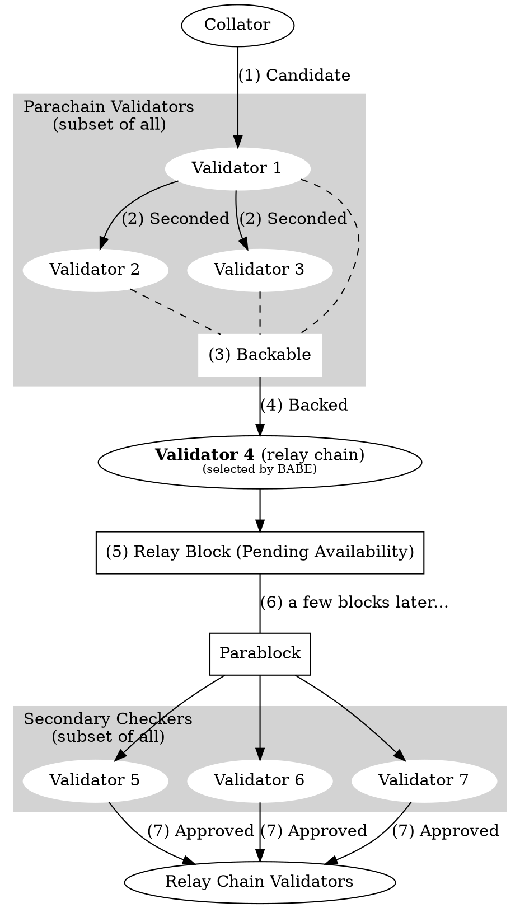
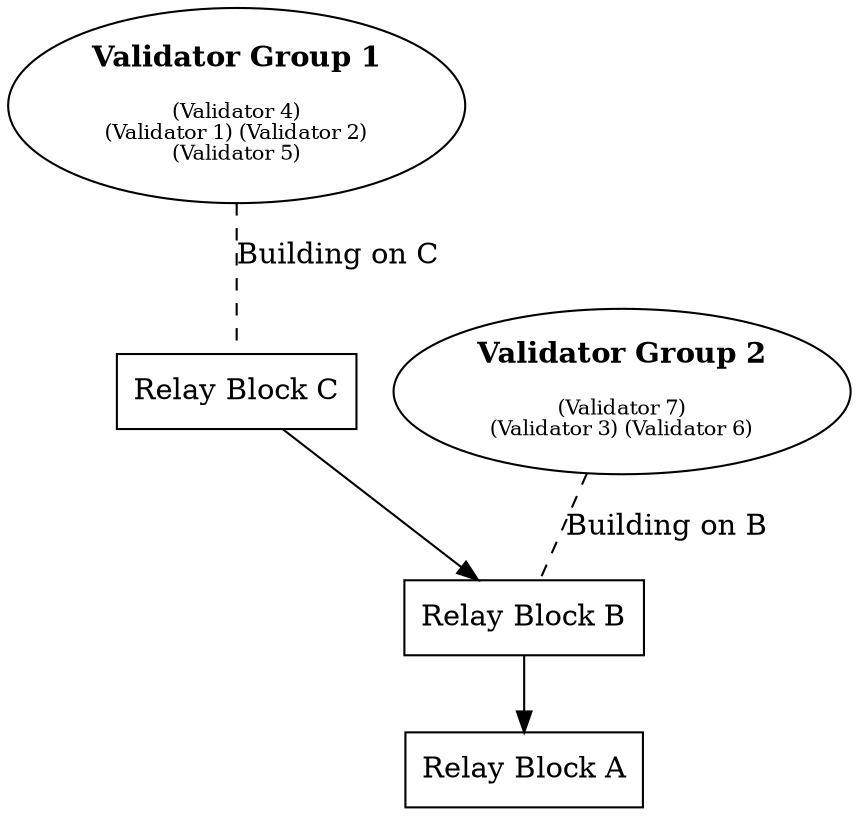
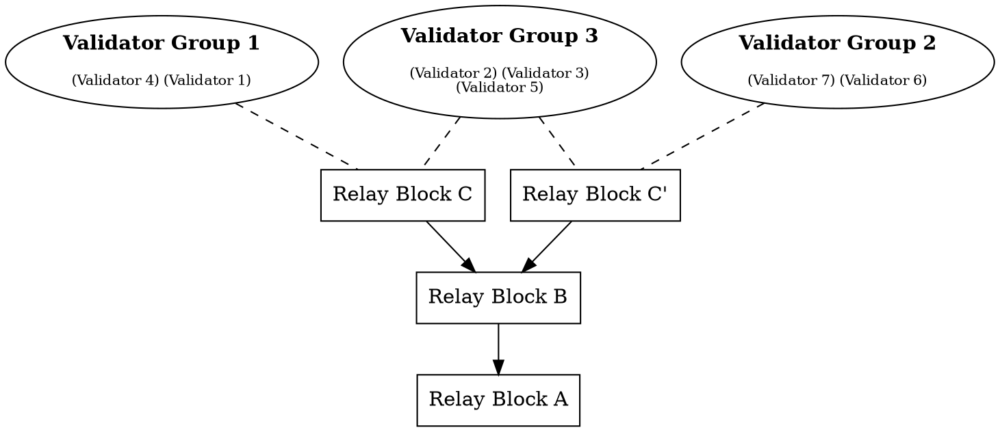

# Protocol Overview

This section aims to describe, at a high level, the actors and protocols involved in running parachains in Polkadot. Specifically, we describe how different actors communicate with each other, what data structures they keep both individually and collectively, and the high-level purpose on why they do these things.

Our top-level goal is to carry a parachain block from authoring to secure inclusion, and define a process which can be carried out repeatedly and in parallel for many different parachains to extend them over time. Understanding of the high-level approach taken here is important to provide context for the proposed architecture further on. The key parts of Polkadot relevant to this are the main Polkadot blockchain, known as the relay-chain, and the actors which provide security and inputs to this blockchain.

First, it's important to go over the main actors we have involved in this protocol.

1. Validators. These nodes are responsible for validating proposed parachain blocks. They do so by checking a Proof-of-Validity (PoV) of the block and ensuring that the PoV remains available. They put financial capital down as "skin in the game" which can be slashed (destroyed) if they are proven to have misvalidated.
1. Collators. These nodes are responsible for creating the Proofs-of-Validity that validators know how to check. Creating a PoV typically requires familiarity with the transaction format and block authoring rules of the parachain, as well as having access to the full state of the parachain.
1. Fishermen. These are user-operated, permissionless nodes whose goal is to catch misbehaving validators in exchange for a bounty. Collators and validators can behave as Fishermen too. Fishermen aren't necessary for security, and aren't covered in-depth by this document.

This implies a simple pipeline where collators send validators parachain blocks and their requisite PoV to check. Then, validators validate the block using the PoV, signing statements which describe either the positive or negative outcome, and with enough positive statements, the block can be noted on the relay-chain. Negative statements are not a veto but will lead to a dispute, with those on the wrong side being slashed. If another validator later detects that a validator or group of validators incorrectly signed a statement claiming a block was valid, then those validators will be _slashed_, with the checker receiving a bounty.

However, there is a problem with this formulation. In order for another validator to check the previous group of validators' work after the fact, the PoV must remain _available_ so the other validator can fetch it in order to check the work. The PoVs are expected to be too large to include in the blockchain directly, so we require an alternate _data availability_ scheme which requires validators to prove that the inputs to their work will remain available, and so their work can be checked. Empirical tests tell us that many PoVs may be between 1 and 10MB during periods of heavy load.

Here is a description of the Inclusion Pipeline: the path a parachain block (or parablock, for short) takes from creation to inclusion:

1. Validators are selected and assigned to parachains by the Validator Assignment routine.
1. A collator produces the parachain block, which is known as a parachain candidate or candidate, along with a PoV for the candidate.
1. The collator forwards the candidate and PoV to validators assigned to the same parachain via the [Collator Protocol](node/collators/collator-protocol.md).
1. The validators assigned to a parachain at a given point in time participate in the [Candidate Backing subsystem](node/backing/candidate-backing.md) to validate candidates that were put forward for validation. Candidates which gather enough signed validity statements from validators are considered "backable". Their backing is the set of signed validity statements.
1. A relay-chain block author, selected by BABE, can note up to one (1) backable candidate for each parachain to include in the relay-chain block alongside its backing. A backable candidate once included in the relay-chain is considered backed in that fork of the relay-chain.
1. Once backed in the relay-chain, the parachain candidate is considered to be "pending availability". It is not considered to be included as part of the parachain until it is proven available.
1. In the following relay-chain blocks, validators will participate in the [Availability Distribution subsystem](node/availability/availability-distribution.md) to ensure availability of the candidate. Information regarding the availability of the candidate will be noted in the subsequent relay-chain blocks.
1. Once the relay-chain state machine has enough information to consider the candidate's PoV as being available, the candidate is considered to be part of the parachain and is graduated to being a full parachain block, or parablock for short.

Note that the candidate can fail to be included in any of the following ways:

- The collator is not able to propagate the candidate to any validators assigned to the parachain.
- The candidate is not backed by validators participating in the Candidate Backing Subsystem.
- The candidate is not selected by a relay-chain block author to be included in the relay chain
- The candidate's PoV is not considered as available within a timeout and is discarded from the relay chain.

This process can be divided further down. Steps 2 & 3 relate to the work of the collator in collating and distributing the candidate to validators via the Collation Distribution Subsystem. Steps 3 & 4 relate to the work of the validators in the Candidate Backing Subsystem and the block author (itself a validator) to include the block into the relay chain. Steps 6, 7, and 8 correspond to the logic of the relay-chain state-machine (otherwise known as the Runtime) used to fully incorporate the block into the chain. Step 7 requires further work on the validators' parts to participate in the Availability Distribution Subsystem and include that information into the relay chain for step 8 to be fully realized.

This brings us to the second part of the process. Once a parablock is considered available and part of the parachain, it is still "pending approval". At this stage in the pipeline, the parablock has been backed by a majority of validators in the group assigned to that parachain, and its data has been guaranteed available by the set of validators as a whole. Once it's considered available, the host will even begin to accept children of that block. At this point, we can consider the parablock as having been tentatively included in the parachain, although more confirmations are desired. However, the validators in the parachain-group (known as the "Parachain Validators" for that parachain) are sampled from a validator set which contains some proportion of byzantine, or arbitrarily malicious members. This implies that the Parachain Validators for some parachain may be majority-dishonest, which means that (secondary) approval checks must be done on the block before it can be considered approved. This is necessary only because the Parachain Validators for a given parachain are sampled from an overall validator set which is assumed to be up to <1/3 dishonest - meaning that there is a chance to randomly sample Parachain Validators for a parachain that are majority or fully dishonest and can back a candidate wrongly. The Approval Process allows us to detect such misbehavior after-the-fact without allocating more Parachain Validators and reducing the throughput of the system. A parablock's failure to pass the approval process will invalidate the block as well as all of its descendents. However, only the validators who backed the block in question will be slashed, not the validators who backed the descendents.

The Approval Process, at a glance, looks like this:

1. Parablocks that have been included by the Inclusion Pipeline are pending approval for a time-window known as the secondary checking window.
1. During the secondary-checking window, validators randomly self-select to perform secondary checks on the parablock.
1. These validators, known in this context as secondary checkers, acquire the parablock and its PoV, and re-run the validation function.
1. The secondary checkers gossip the result of their checks. Contradictory results lead to escalation, where all validators are required to check the block. The validators on the losing side of the dispute are slashed.
1. At the end of the Approval Process, the parablock is either Approved or it is rejected. More on the rejection process later.

More information on the Approval Process can be found in the dedicated section on [Approval](protocol-approval.md). More information on Disputes can be found in the dedicated section on [Disputes](protocol-disputes.md).

These two pipelines sum up the sequence of events necessary to extend and acquire full security on a Parablock. Note that the Inclusion Pipeline must conclude for a specific parachain before a new block can be accepted on that parachain. After inclusion, the Approval Process kicks off, and can be running for many parachain blocks at once.

Reiterating the lifecycle of a candidate:

1. Candidate: put forward by a collator to a validator.
1. Seconded: put forward by a validator to other validators
1. Backable: validity attested to by a majority of assigned validators
1. Backed: Backable & noted in a fork of the relay-chain.
1. Pending availability: Backed but not yet considered available.
1. Included: Backed and considered available.
1. Accepted: Backed, available, and undisputed

The diagram above shows the happy path of a block from (1) Candidate to the (7) Approved state.

It is also important to take note of the fact that the relay-chain is extended by BABE, which is a forkful algorithm. That means that different block authors can be chosen at the same time, and may not be building on the same block parent. Furthermore, the set of validators is not fixed, nor is the set of parachains. And even with the same set of validators and parachains, the validators' assignments to parachains is flexible. This means that the architecture proposed in the next chapters must deal with the variability and multiplicity of the network state.

In this example, group 1 has received block C while the others have not due to network asynchrony. Now, a validator from group 2 may be able to build another block on top of B, called C'. Assume that afterwards, some validators become aware of both C and C', while others remain only aware of one.

Those validators that are aware of many competing heads must be aware of the work happening on each one. They may contribute to some or a full extent on both. It is possible that due to network asynchrony two forks may grow in parallel for some time, although in the absence of an adversarial network this is unlikely in the case where there are validators who are aware of both chain heads.
