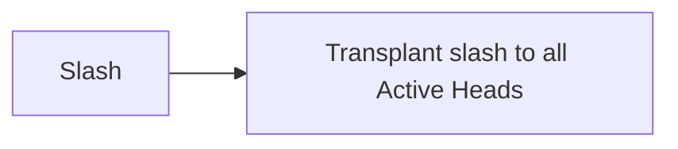
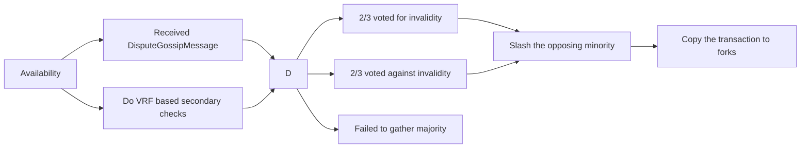
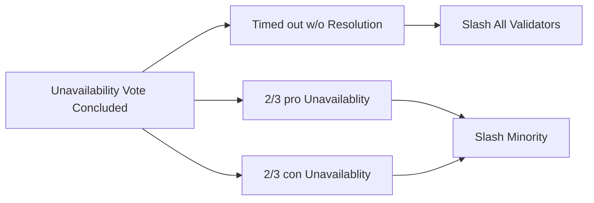
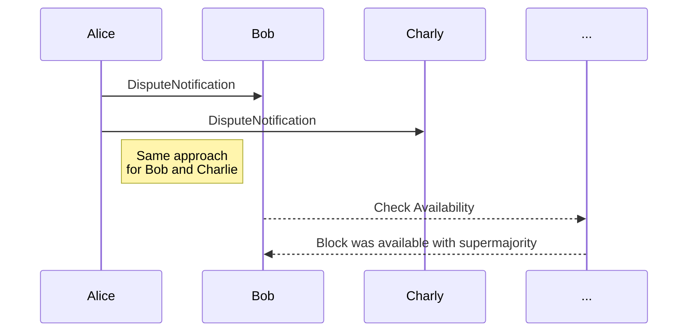
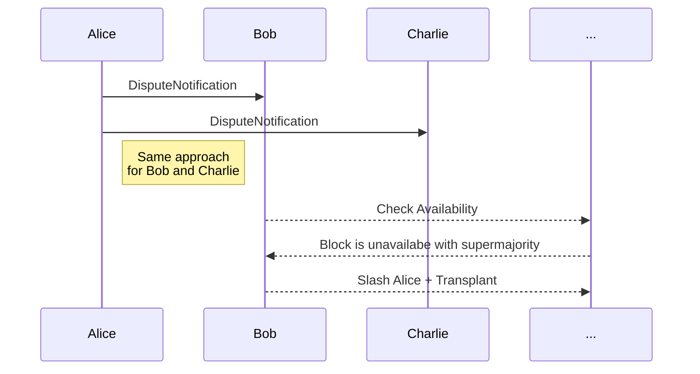
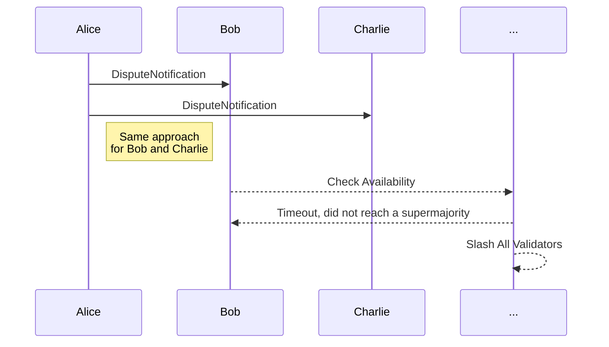

# Disputes Module

## Context

After a backed candidate is made available, it is included and proceeds into an acceptance period during which validators are randomly selected to do (secondary) approval checks of the parablock. Any reports disputing the validity of the candidate will cause escalation, where even more validators are requested to check the block, and so on, until either the parablock is determined to be invalid or valid. Those on the wrong side of the dispute are slashed and, if the parablock is deemed invalid, the relay chain is rolled back to a point before that block was included.

However, this isn't the end of the story. We are working in a forkful blockchain environment, which carries three important considerations:

1. For security, validators that misbehave shouldn't only be slashed on one fork, but on all possible forks. Validators that misbehave shouldn't be able to create a new fork of the chain when caught and get away with their misbehavior.
1. It is possible that the parablock being contested has not appeared on all forks.
1. If a block author believes that there is a disputed parablock on a specific fork that will resolve to a reversion of the fork, that block author is better incentivized to build on a different fork which does not include that parablock.

This means that in all likelihood, there is the possibility of disputes that are started on one fork of the relay chain, and as soon as the dispute resolution process starts to indicate that the parablock is indeed invalid, that fork of the relay chain will be abandoned and the dispute will never be fully resolved on that chain.

Even if this doesn't happen, there is the possibility that there are two disputes underway, and one resolves leading to a reversion of the chain before the other has concluded. In this case we want to both transplant the concluded dispute onto other forks of the chain as well as the unconcluded dispute.

We account for these requirements by having the validity module handle two kinds of disputes.

1. Local disputes: those contesting the validity of the current fork by disputing a parablock included within it.
1. Remote disputes: a dispute that has partially or fully resolved on another fork which is transplanted to the local fork for completion and eventual slashing.

## Information Consumption from Availability

There is little overlap between the approval system and the disputes systems since disputes cares only that two validators disagree.
However it is required that disputes count validity votes from elsewhere, both the backing votes and the approval votes.
This is necessary to slash the losing party appropriately which is based on the voting behaviour and resolution.

## Local Disputes

We could approve, and even finalize,
a relay chain block which then later disputes
due to claims of some parachain being invalid.

> TODO: store all included candidate and attestations on them here.

> TODO: accept additional backing after the fact

> TODO: accept reports based on VRF

> TODO: candidate included in session S should only be reported on by validator keys from session S. trigger slashing. probably only slash for session S even if the report was submitted in session S+k because it is hard to unify identity

The local disputes are necessary in order to create the first escalation that leads to block producers abandoning the chain and making remote disputes possible.

Local disputes are only allowed on parablocks that have been included on the **local** chain and are in the acceptance period.

For each such parablock, it is guaranteed by the inclusion pipeline that the parablock is available and the relevant validation code is available.

Disputes may occur against blocks that have happened in the session prior to the current one, from the perspective of the chain.

In this case, the prior validator set is responsible for handling the dispute and to do so with their keys from the last session.
This means that validator duty actually extends 1 session beyond leaving the validator set.

Wait for a 2/3 majority either way, by counting incoming votes. Or timeout.

After concluding with enough validators voting, the dispute will remain open for some time in order to collect further evidence of misbehaving validators, and then, issue a signal in the header-chain that this fork should be abandoned along with the hash of the last ancestor before inclusion, which the chain should be reverted to, along with information about the invalid block that should be used to blacklist it from being included.

> TODO: rephrases `signal in the header-chain`

## Remote Disputes

Slashing must happen off-chain, since there is no guarantee that forks of the current selected head, will receive any more
blocks. As such that block must be scheduled in the transaction pool (?).



On dispute detection, the full block that is disputed is gossiped to all peers.

Votes in favour of block validity always includes the primary votes from the `Backing` stage.

Votes aginst the block validity always include the initial challenger from the `Backing` stage iff any.

Session change implies a change of session keys. Hence at least two validator sets must be kept - the set of validators in the current session and the ones in the previous session.
The timeouts must be set accordingly to guarantee that two sessions are sufficient, and timeout actions are not triggered in a 3rd session.
An era change implies a session change, since the nominators change.

When a dispute has occurred on another fork, we need to transplant that dispute to every other fork. This poses some major challenges.

There are two types of remote disputes. **Concluded** and **Unconcluded**.

The first is a remote roll-up of a **concluded dispute**. These are simply all attestations for the block, those against it, and the result of all (secondary) approval checks. A concluded remote dispute can be resolved in a single transaction as it is an open-and-shut case of a quorum of validators disagreeing with another.

The second type of remote dispute is the **unconcluded dispute**. An unconcluded remote dispute is started by any validator using a `UnconcludedDisputeGossipNotificationMessage`:

When beginning a remote dispute, at least one escalation by a validator is required, but this validator may be malicious and desires to be slashed. There is no guarantee that the para is registered on this fork of the relay chain or that the para was considered available on any fork of the relay chain.

The first step is the escalation, to notify peers of the unconcluded gossip.

## Disputing an Unavailable Candidate

In the case of malicious validator sending a dispute gossip message, with a block hash, that never became part of any parachain.

If the candidate was not made available on another fork of the relay chain (as in it does not exist), the availability process will time out and the disputing validator will be slashed on this fork.
As with other disputes, the escalation

> TODO: is the escalation equivalent to the `DisputeGossipMessage` or is it something separate? Which information must be contained in that.

## Resolving state of availability

The availbility or unavailability of a block disputed in an escalation / `DisputeGossipMessage`.





1. Query all validators iff the disputed block is known to them.
2. Start a timeout of `UNAVAILABILITY_TIMEOUT`
  2. For each incoming vote:
    2. Count the vote as either pro or con unavailability
    2. Iff super majority is reached either way
      2. Shorten the timeout period (in blocks)
3. Timeout reached
  3. Slash all remaining votes appropriately
  3. Transplant slashes transactions to all other relay chain heads off-chain


If the availability process passes, the _remote_ dispute is ready to be voted for.

### Conclusion

As with the local dispute, validators self-select based on a VRF (verifyable random function) todo **what?**.

> TODO: elaborate on what's the point on the VRF self selection.

After enough validator self-select, under the same escalation rules as for local disputes, the _remote_ dispute will conclude, slashing all those on the wrong side of the dispute.

After concluding, the remote dispute remains open for a set amount of blocks to accept any further proof of additional validators being on the wrong side.

`UNAVAILABILITY_TIMEOUT` should be set generously, the validators are bound for 28 days, and this is maximum time until we slash. Recommended timeout is `1d`.

Available disputed candidate:

> TODO: unify notion of `DisputeNotification`, `DisputeGossipMessage` and `...`



With an unavailable block



Timeout during supermajority



# Building Blocks

* session info helper module
* historical slashing provides data about the sessions that would otherwise long be gone, off-chain

# Messages

```rust
/// A vote to describe the tri-state of a cast vote.
enum ValidityVote {
  /// Vote of a validator is pending. If a timeout is reached, this must be counted as no-show.
  Pending,
  /// A vote was cast in favor of something.
  CastSupportValidity,
  /// A vote was cast against the validity.
  CastChallengeValidity,
}
```

```rust
struct ValidityVoteMessage {
  hash: Hash, // the block hash being disputed
  session: SessionIndex,
  validator: ValidatorIndex, // actually a public key
  vote: ValidityVote,
}
```


```rust
struct UnconcludedDisputeGossipNotificationMessage {
  /// Candidate information
  /// (transactions, externalities (such as inherents etc.))
  candidate: Candidate, // TODO or `ValidationData` or a full `Block`?
  /// Session of the candidates appearance
  session: SessionIndex, // prefer session index, which avoids dealing with identity and validator keys
  /// Backing bitfield for that candidate, stores votes of the backing validators.
  backing: Bitfield,
  /// Validation code for the relay chain, excluding in case where code appears in `Paras::CurrentCode` of this fork of relay-chain.
  // TODO current is relative, and the session might change, so the option is very likely pointless, it's mostly a perf optimization for some cases TBD.
  validation_code: Option<ValidationCode>,
  /// Set of secondary checks that already completed. There is no requirement on which chain the validation has to have appeared on.
  /// FIXME does thes need to be a map? Do we need the `AuthorityId` key? Should this better be `ValidatorIndex` (combined with `session` this becomes well defined)
  secondary_checks: Vec<(AuthorityId, ValidityAttestation<Signature>)>
}
```


# Storage

## Storage Helpers

```rust
struct DisputeBitfield {
  /// **two** bits per validator, index `i*2` for pro and `i*2+1` and for con, so the values are `0` open, `1` con, `2` pro, `3` invalid or double vote.
  validators: BitVec,
  /// **two** bits per validator in the previous session, required for disputes that cross session boundaries, encoding like above
  previous_validators: BitVec,
  /// a reference block to reference the right set of validators at the time of submission
  submitted_at: BlockNumber,
}
```

## Storage Layout

```rust
DisputedBlocks: map Hash => DisputeBitfield, // tracks the data required for disputed blocks
```

# Session Change

Can be ignored, since all validators are bonded `N` days beyond their duty.

# Routines

## On-chain

* `process_incoming_inherent(CastVotes, inherent: )`
  > TODO: handle the inherent displaying that something is disputed

* `process_incoming_vote(CastVotes, message: ValidityVoteMessage)`
  1. iff required majority is not reached
    1. iff validator was part of the validators casting backing votes or approval votes
      1. count them as `CastSupport`
    1. else check if validator has voted before
      1. slash for double vote
    1. count vote as part of stored `Votes`
    1. check for super majority
      1. transplant resolution and slashes


* `on_unavailability_timeout(hash: Hash)`
  1. no super majority was reached
    1. iff both parties got > 1/3 of the votes, BUG
    1. else, slash all voting validators
  1. ...


* `shift_session(current: SessionIndex, previous: SessionIndex)`
  1. obtain the current sessions validator set
  2. copy that data back to the previsou session
  3. cancel all ongoing disputes of the now obsolete session

* `on_session_change()`
  1. obtain current session index
  1. obtain previous session index
  1. call `shift_session`

## Off-chain

* `craft_slashing_inherent(to_slash: &[(SessionIndex, ValidatorIndex)]) -> Inherent`
  > TODO: ...

* `transplant(slashing_inherent : Inherent)`

  > TODO: pending `ActiveLeaves` tracking in `ChainAPI` subsystem

  1. query `active_heads` set
  1. for each `active_head` in `active_heads`
    1. queue a transaction with the `slashing_inherent`


# Open Questions

  - what happens with open disputes on session / era change?
  - > TODO: validator-dispute could be instead replaced by a fisherman w/ bond
  - > TODO: Given that a remote dispute is likely to be replayed across multiple forks, it is important to choose a VRF in a way that all forks processing the remote dispute will have the same one. Choosing the VRF is important as it should not allow an adversary to have control over who will be selected as a secondary approval checker.
  - decided and describe **era** change validator set change resolution
  - decided and describe **session** change validator set change resolution
  - who can dispute, validators of the current session? Or also validators of the previous session?

## Slashing and Incentivization

The goal of the dispute is to garner a majority either in favor of or against the candidate.

For remote disputes, it is possible that the parablock disputed has never actually passed any availability process on any chain. In this case, validators will not be able to obtain the PoV of the parablock and there will be relatively few votes. We want to disincentivize voters claiming validity of the block from preventing it from becoming available, so we charge them a small distraction fee for wasting the others' time if the dispute does not garner a 2/3+ supermajority on either side. This fee can take the form of a small slash or a reduction in rewards.

When a supermajority is achieved for the dispute in either the valid or invalid direction, we will penalize non-voters either by issuing a small slash or reducing their rewards. We prevent censorship of the remaining validators by leaving the dispute open for some blocks after resolution in order to accept late votes.


## Threat Model

* A remote validator is taken over by a malicious party and desires to be slashed.
* Network bipartition can lead to not reach the required quorum to conclude a dispute.

## Assumptions

* An adversary cannot censor validators from seeing any particular forks indefinitely.
* Remote disputes are with respect to the same validator set as on the current fork, as BABE and GRANDPA assure that forks are never long enough to diverge in validator set.
  > TODO: this is at least directionally correct. handling disputes on other validator sets seems useless anyway as they wouldn't be bonded.
*

## Impl. Notes / Constraints

* Transplanting slashing transactions must happen off-chain, since there is no guarantee that the fork will receive any more blocks.
* Supermajority is given when `x >= ($votes - $votes/3)` which guarantees the correct rounding behaviour also denoted as `>2/3` (`2f + 1`)
