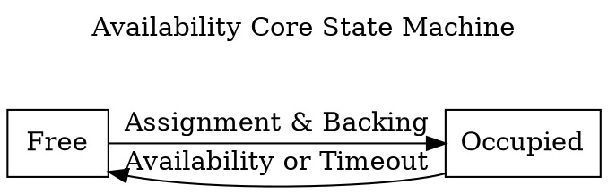
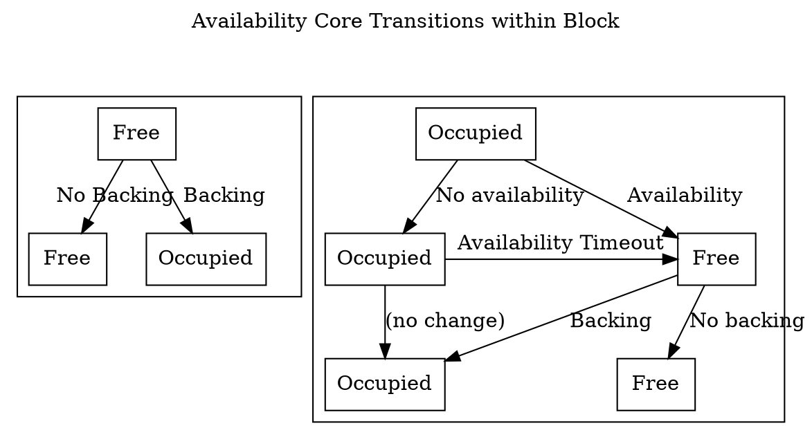

# Scheduler Module

> TODO: this section is still heavily under construction. key questions about availability cores and validator assignment are still open and the flow of the the section may be contradictory or inconsistent

The Scheduler module is responsible for two main tasks:

- Partitioning validators into groups and assigning groups to parachains and parathreads.
- Scheduling parachains and parathreads

It aims to achieve these tasks with these goals in mind:

- It should be possible to know at least a block ahead-of-time, ideally more, which validators are going to be assigned to which parachains.
- Parachains that have a candidate pending availability in this fork of the chain should not be assigned.
- Validator assignments should not be gameable. Malicious cartels should not be able to manipulate the scheduler to assign themselves as desired.
- High or close to optimal throughput of parachains and parathreads. Work among validator groups should be balanced.

## Availability Cores

The Scheduler manages resource allocation using the concept of "Availability Cores". There will be one availability core for each parachain, and a fixed number of cores used for multiplexing parathreads. Validators will be partitioned into groups, with the same number of groups as availability cores. Validator groups will be assigned to different availability cores over time.

An availability core can exist in either one of two states at the beginning or end of a block: free or occupied. A free availability core can have a parachain or parathread assigned to it for the potential to have a backed candidate included. After backing, the core enters the occupied state as the backed candidate is pending availability. There is an important distinction: a core is not considered occupied until it is in charge of a block pending availability, although the implementation may treat scheduled cores the same as occupied ones for brevity. A core exits the occupied state when the candidate is no longer pending availability - either on timeout or on availability. A core starting in the occupied state can move to the free state and back to occupied all within a single block, as availability bitfields are processed before backed candidates. At the end of the block, there is a possible timeout on availability which can move the core back to the free state if occupied.

Cores are treated as an ordered list and are typically referred to by their index in that list.





## Validator Groups

Validator group assignments do not need to change very quickly. The security benefits of fast rotation are redundant with the challenge mechanism in the [Approval process](../protocol-approval.md). Because of this, we only divide validators into groups at the beginning of the session and do not shuffle membership during the session. However, we do take steps to ensure that no particular validator group has dominance over a single parachain or parathread-multiplexer for an entire session to provide better guarantees of live-ness.

Validator groups rotate across availability cores in a round-robin fashion, with rotation occurring at fixed intervals. The i'th group will be assigned to the `(i+k)%n`'th core at any point in time, where `k` is the number of rotations that have occurred in the session, and `n` is the number of cores. This makes upcoming rotations within the same session predictable.

When a rotation occurs, validator groups are still responsible for distributing availability chunks for any previous cores that are still occupied and pending availability. In practice, rotation and availability-timeout frequencies should be set so this will only be the core they have just been rotated from. It is possible that a validator group is rotated onto a core which is currently occupied. In this case, the validator group will have nothing to do until the previously-assigned group finishes their availability work and frees the core or the availability process times out. Depending on if the core is for a parachain or parathread, a different timeout `t` from the [`HostConfiguration`](../types/runtime.md#host-configuration) will apply. Availability timeouts should only be triggered in the first `t-1` blocks after the beginning of a rotation.

## Claims

Parathreads operate on a system of claims. Collators participate in auctions to stake a claim on authoring the next block of a parathread, although the auction mechanism is beyond the scope of the scheduler. The scheduler guarantees that they'll be given at least a certain number of attempts to author a candidate that is backed. Attempts that fail during the availability phase are not counted, since ensuring availability at that stage is the responsibility of the backing validators, not of the collator. When a claim is accepted, it is placed into a queue of claims, and each claim is assigned to a particular parathread-multiplexing core in advance. Given that the current assignments of validator groups to cores are known, and the upcoming assignments are predictable, it is possible for parathread collators to know who they should be talking to now and how they should begin establishing connections with as a fallback.

With this information, the Node-side can be aware of which parathreads have a good chance of being includable within the relay-chain block and can focus any additional resources on backing candidates from those parathreads. Furthermore, Node-side code is aware of which validator group will be responsible for that thread. If the necessary conditions are reached for core reassignment, those candidates can be backed within the same block as the core being freed.

Parathread claims, when scheduled onto a free core, may not result in a block pending availability. This may be due to collator error, networking timeout, or censorship by the validator group. In this case, the claims should be retried a certain number of times to give the collator a fair shot.

## Storage

Utility structs:

```rust
// A claim on authoring the next block for a given parathread.
struct ParathreadClaim(ParaId, CollatorId);

// An entry tracking a claim to ensure it does not pass the maximum number of retries.
struct ParathreadEntry {
  claim: ParathreadClaim,
  retries: u32,
}

// A queued parathread entry, pre-assigned to a core.
struct QueuedParathread {
  claim: ParathreadEntry,
  /// offset within the set of para-threads ranged `0..config.parathread_cores`.
  core_offset: u32,
}

struct ParathreadQueue {
  queue: Vec<QueuedParathread>,
  /// offset within the set of para-threads ranged `0..config.parathread_cores`.
  next_core_offset: u32,
}

enum CoreOccupied {
  Parathread(ParathreadEntry), // claim & retries
  Parachain,
}

enum AssignmentKind {
  Parachain,
  Parathread(CollatorId, u32),
}

struct CoreAssignment {
  core: CoreIndex,
  para_id: ParaId,
  kind: AssignmentKind,
  group_idx: GroupIndex,
}
// reasons a core might be freed.
enum FreedReason {
  Concluded,
  TimedOut,
}
```

Storage layout:

```rust
/// All the validator groups. One for each core. Indices are into the `ActiveValidators` storage.
ValidatorGroups: Vec<Vec<ValidatorIndex>>;
/// A queue of upcoming claims and which core they should be mapped onto.
ParathreadQueue: ParathreadQueue;
/// One entry for each availability core. Entries are `None` if the core is not currently occupied.
/// The i'th parachain belongs to the i'th core, with the remaining cores all being
/// parathread-multiplexers.
AvailabilityCores: Vec<Option<CoreOccupied>>;
/// An index used to ensure that only one claim on a parathread exists in the queue or is
/// currently being handled by an occupied core.
ParathreadClaimIndex: Vec<ParaId>;
/// The block number where the session start occurred. Used to track how many group rotations have occurred.
SessionStartBlock: BlockNumber;
/// Currently scheduled cores - free but up to be occupied.
/// The value contained here will not be valid after the end of a block. 
/// Runtime APIs should be used to determine scheduled cores
/// for the upcoming block.
Scheduled: Vec<CoreAssignment>, // sorted ascending by CoreIndex.
```

## Session Change

Session changes are the only time that configuration can change, and the [Configuration module](configuration.md)'s session-change logic is handled before this module's. We also lean on the behavior of the [Inclusion module](inclusion.md) which clears all its occupied cores on session change. Thus we don't have to worry about cores being occupied across session boundaries and it is safe to re-size the `AvailabilityCores` bitfield.

Actions:

1. Set `SessionStartBlock` to current block number + 1, as session changes are applied at the end of the block.
1. Clear all `Some` members of `AvailabilityCores`. Return all parathread claims to queue with retries un-incremented.
1. Set `configuration = Configuration::configuration()` (see [`HostConfiguration`](../types/runtime.md#host-configuration))
1. Fetch `Shared::ActiveValidators` as AV.
1. Determine the number of cores & validator groups as `n_cores`. This is the maximum of
   1. `Paras::parachains().len() + configuration.parathread_cores`
   1. `n_validators / max_validators_per_core` if `configuration.max_validators_per_core` is `Some` and non-zero.
1. Resize `AvailabilityCores` to have length `n_cores` with all `None` entries.
1. Compute new validator groups by shuffling using a secure randomness beacon
   - Note that the total number of validators `V` in AV may not be evenly divided by `n_cores`.
   - The groups are selected by partitioning AV.  The first `V % N` groups will have `(V / n_cores) + 1` members, while the remaining groups will have `(V / N)` members each.
   - Instead of using the indices within AV, which point to the broader set, indices _into_ AV should be used. This implies that groups should have simply ascending validator indices.
1. Prune the parathread queue to remove all retries beyond `configuration.parathread_retries`.
   - Also prune all parathread claims corresponding to de-registered parathreads.
   - all pruned claims should have their entry removed from the parathread index.
   - assign all non-pruned claims to new cores if the number of parathread cores has changed between the `new_config` and `old_config` of the `SessionChangeNotification`.
   - Assign claims in equal balance across all cores if rebalancing, and set the `next_core` of the `ParathreadQueue` by incrementing the relative index of the last assigned core and taking it modulo the number of parathread cores. 

## Initialization

No initialization routine runs for this module.

## Finalization

No finalization routine runs for this module.

## Routines

- `add_parathread_claim(ParathreadClaim)`: Add a parathread claim to the queue.
  - Fails if any parathread claim on the same parathread is currently indexed.
  - Fails if the queue length is >= `config.scheduling_lookahead * config.parathread_cores`.
  - The core used for the parathread claim is the `next_core` field of the `ParathreadQueue` and adding `Paras::parachains().len()` to it.
  - `next_core` is then updated by adding 1 and taking it modulo `config.parathread_cores`.
  - The claim is then added to the claim index.
- `free_cores(Vec<(CoreIndex, FreedReason)>)`: indicate previosuly-occupied cores which are to be considered returned and why they are being returned.
  - All freed parachain cores should be assigned to their respective parachain
  - All freed parathread cores whose reason for freeing was `FreedReason::Concluded` should have the claim removed from the claim index.
  - All freed parathread cores whose reason for freeing was `FreedReason::TimedOut` should have the claim added to the parathread queue again without retries incremented
  - All freed parathread cores should take the next parathread entry from the queue.
- `schedule(Vec<(CoreIndex, FreedReason)>, now: BlockNumber)`: schedule new core assignments, with a parameter indicating previously-occupied cores which are to be considered returned and why they are being returned.
  - Invoke `free_cores(freed_cores)`
  - The i'th validator group will be assigned to the `(i+k)%n`'th core at any point in time, where `k` is the number of rotations that have occurred in the session, and `n` is the total number of cores. This makes upcoming rotations within the same session predictable. Rotations are based off of `now`.
- `scheduled() -> Vec<CoreAssignment>`: Get currently scheduled core assignments.
- `occupied(Vec<CoreIndex>)`. Note that the given cores have become occupied.
  - Behavior undefined if any given cores were not scheduled.
  - Behavior undefined if the given cores are not sorted ascending by core index
  - This clears them from `Scheduled` and marks each corresponding `core` in the `AvailabilityCores` as occupied.
  - Since both the availability cores and the newly-occupied cores lists are sorted ascending, this method can be implemented efficiently.
- `core_para(CoreIndex) -> ParaId`: return the currently-scheduled or occupied ParaId for the given core.
- `group_validators(GroupIndex) -> Option<Vec<ValidatorIndex>>`: return all validators in a given group, if the group index is valid for this session.
- `availability_timeout_predicate() -> Option<impl Fn(CoreIndex, BlockNumber) -> bool>`: returns an optional predicate that should be used for timing out occupied cores. if `None`, no timing-out should be done. The predicate accepts the index of the core, and the block number since which it has been occupied. The predicate should be implemented based on the time since the last validator group rotation, and the respective parachain and parathread timeouts, i.e. only within `max(config.chain_availability_period, config.thread_availability_period)` of the last rotation would this return `Some`.
- `group_rotation_info(now: BlockNumber) -> GroupRotationInfo`: Returns a helper for determining group rotation.
- `next_up_on_available(CoreIndex) -> Option<ScheduledCore>`: Return the next thing that will be scheduled on this core assuming it is currently occupied and the candidate occupying it became available. Returns in `ScheduledCore` format (todo: link to Runtime APIs page; linkcheck doesn't allow this right now). For parachains, this is always the ID of the parachain and no specified collator. For parathreads, this is based on the next item in the `ParathreadQueue` assigned to that core, and is `None` if there isn't one.
- `next_up_on_time_out(CoreIndex) -> Option<ScheduledCore>`: Return the next thing that will be scheduled on this core assuming it is currently occupied and the candidate occupying it timed out. Returns in `ScheduledCore` format (todo: link to Runtime APIs page; linkcheck doesn't allow this right now). For parachains, this is always the ID of the parachain and no specified collator. For parathreads, this is based on the next item in the `ParathreadQueue` assigned to that core, or if there isn't one, the claim that is currently occupying the core. Otherwise `None`.
- `clear()`:
  - Free all scheduled cores and return parathread claims to queue, with retries incremented. Skip parathreads which no longer exist under paras.
