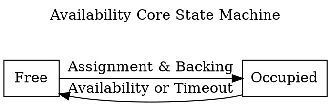
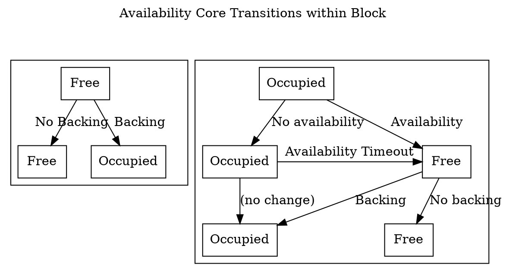

- Top level responsibilities of the scheduler
- Interfaces
- Considerations async backing (see ticket)

# Interfaces for parathreads

## User Interface

The entry point for the user is twofold:

1. Registering a PVF with some deposit
2. Actually bidding for a slot.

### Registering a PVF with some deposit

This is the same as for parachains. In fact parachains start as a parathread
exactly this way.

### Bidding for a slot/Auctioning System

#### Goals

1. Price finding
2. Be efficient ... we are talking about slots for single blocks, the overhead
   of assignment should be minimal.
3. Maximize utilization: Avoid empty slots, as long as there is demand from
   parathread willing to pay the minimum price.
4. DoS resistance: We should not be able to get flooded with dubious bids, that
   just fill up runtime resources.
5. Lifetime/Update: Bids should have some lifetime or alternatively need to be
   upgradeable. E.g. someone puts in a bid, but it is too low and is constantly
   outbid by other bids ... eventually we either no longer care ... would like
   to remove the bid or increase it, so it will finally make it.
6. The user needs to know whether their bid made it through or not and when.

#### General Interface


TODO: Obsolete

The user can apply for a slot by placing a bid extrinsic. This bid will contain
some price the user is willing to pay for a core. These extrinsic go into a
transaction pool, as other extrinsics.

There should be no reason to place bids long before we want to claim a slot. If
spam protection mechanism are effective you should just send the bid, when you
want to have a core in the near future ... bids will have some lifetime
specified. If they don't manage to win a slot within that lifetime, they are
dropped. The user would then need to bid again.

Needs:

1. Expose: Realistic price to pay right now. (E.g. expose recent max/lowest
   prices/average).
2. Actual utilization - related to price, but nevertheless good to know
   explicitly. If there are lots of free cores right now, it is "safe" to go with
   the minimum bid.
3. Some form of lifetime ... Some time frame the user can expect to either get a
   core or know for sure he won't get any. Needs to be exposed somehow? - HOW?
4. The user does not need to be able to specify a start ... once he submits a
   bid, we treat this as "get me a core asap". No need to be able to schedule in
   advance.

I think it is fine for the lifetime to be implicit (determined by the system,
e.g. by a 10 block auction mechanism), but we need to expose what happened to
the bid. The actual auction mechanism used, should not be exposed.

#### Node Side Implementation

On the node side validators should be able to do some pre-processing on bids,
for handling spam. In particular this is only relevant, if there are lots of
bids. Ideally on the node side we would already:

1. Check signatures, remove invalid bids and disconnect peers providing such
   bids.
2. If a certain threshold of pending bids is reached, we can start dropping
   lowest bids.

TODO: How does this work with transactions? Can we even check signatures on the
node side? If we don't check signatures on the node side, then how can we be
spam resistant?

Then the block producer should put bids into the block, limited by some maximum
amount (don't overflow runtime memory). Higher bids take precedence obviously.

If exposed how many parathread cores are available, that information can be
taken into account by the block producer: E.g. if there are 3 cores available,
10 blocks would mean approximately 30 bids are useful to have in the runtime
right now. It would not be useful to put 10000 bids into a block for example.
Block producers should then likely expire bids in the transaction pool already,
if they don't make it after some to be specified lifetime.

Expiring bids makes sense to keep resource usage down, but also helps with
keeping expectations: If we say you bid now for a block asap, it would be out of
expectations if your bid finally gets accepted two days later. This aspect would
not need to be implemented on the node side though, but is already an
optimization. We could also just import everything into the runtime and let the
runtime drop what is too low (if resource limits allow for it).

#### Runtime Implementation

TODO: Update.

#### Possible Optimizations

With the above, a user has to place an individual bid for each and every core
desired. This is quite wasteful, if multiple cores are needed as a point in
time. As each of these bids would likely be identical and each of them would
need to be signed. What we can do is extend the format of the extrinsic slightly
to contain a number specifying how many cores are desired and whether parallel
cores are allowed (winning two cores in a single block). Likely a `max_parallel`
parameter. Then the user can submit a single extrinsic, with only a single
signature biding for e.g. 10 cores. Internally we treat those as individual
equal bids (all the same price), competing individually with all the other bids.
Therefore it is possible that only a fraction of the desired cores will actually
be won. E.g. just one or two out of the ten desired.


## Where is the money going?

TODO: Bids and fees - where are they spent, what pallet do we need to interact here
with?

We should probably be interacting with the Balances pallet via the ReservableCurrency trait.

## Scheduler/Collators/Validators

1. Collators need to know in advance when they should connect to which validator
   group to prepare and send a collation.
2. Validators need to know in advance what collators for which
   parachains/parathreads they should accept connections and collations from.
3. Users need to know whether they won a slot or not - seeing assigned cores
   could be one way of achieving that goal. (Likely not very suitable though).
4. We need to be able to "back-pressure" on individual cores, in case
   availability is taking longer.

### Interface from assignment providers to the scheduler

TODO: Interface still correct, considerations have changed a bit.

The scheduler needs to be able to map `ParaId`s to `CoreIds` for each relay
chain block, for asynchronous backing in advance. The `AssignmentProvider` can
provide suitable `ParaId`s for the scheduler to assign to cores.

For this the scheduler maintains a claim queue for each core of some size.
This queue allows for the needed lookahead. The scheduler tries to maintain a
desired (configured) size. Whenever a core gets free (became available or timed
out), the scheduler will ask its assignment provider for another
assignment for that core.

I am therefore suggesting an interface looking like this:

```rust
trait AssignmentProvider {
  /// Get and consume the next assignment for the core, if available.
  ///
  /// Returns an error, if index is out of bounds. Returns `Ok(None)` if no
  /// furhter assignments are available for that core.
  pub fn pop_assignment_for_core(&mut self, core_id: CoreId) -> Result<Option<ParaId>>;
}
```

On each block, the scheduler will check its claim queue sizes for each core.
Then it calls `pop_assignment_for_core` on its given `AssignmentProvider` for
each core where the claim queue size is smaller than desired, until the queue is
either full or `pop_assignment_for_core` returns `None`.

Whenever a core becomes free, we reduce the corresponding `ClaimQueue` size by
one.

A single implementation of `AssignmentProvider` needs to be passed to the
scheduler, internally the given `AssignmentProvider` can delegate to other providers
handling sub areas, but that is completely transparent to the scheduler. E.g.:

```rust
struct PolkadotAssignmentProvider {
  parathread_provider: ParathreadProvider,
  parachain_provider: ParachainProvider,
}

impl AssignmentProvider for PolkadotAssignmentProvider {
  fn pop_assignment_for_core(&mut self, core_id: CoreId) -> Result<Option<ParaId>> {
     match self.get_sub_index(core_id) {
       SubIndex::Parathread(thread_id) =>
         self.parathread_provider.pop_assignment(thread_id),
       SubIndex::Parachain(chain_id) =>
         self.parachain_provider.pop_assignment(chain_id),
     }
   }
}
// What core ranges belong to which provider will be configurable and can change
// at session boundaries.
```

The providers need to be able to handle some cores moving faster than others.
For example, if availability is slower on one core for some reason, then the
scheduler will call `pop_assignment_for_core` less on that core ... it will
impose some back pressure. The provider needs to be able to handle this.

Open questions:

With this interface we will charge parathreads fully once
`pop_assignment_for_core` got called, no matter what happens next. That is even
on error. This adds to simplicity, great if acceptable ... I think at least for
a first run it is. This is one of those things that can be improved, once it is
actually causing problems. -> Especially with async backing it is actually quite
unlikely that things fail.


### Interface from the scheduler to the node size (collators/validators)

We have been a bit fuzzy with the claim queue here, time to make it more
concrete. The claim queue is used internally by the scheduler to be able to
satisfy a lookahead on assignments. It could look something like this:

```rust
/// A claim queue for a single core:
struct ClaimQueue {
  /// Actual queue:
  queue: Vec<ParaId>
  /// A claim previously in queue directly, that is now pending availability.
  ///
  /// It is counting towards the queue size, in the sense that we only request
  /// another assignment once the core is freed again.
  pending_availability: PendingAvailabilityClam,

}

struct PendingAvailabilityClaim {
  /// The para that is currently occupying the core.
  para: ParaId,
  /// The position in the queue the claim had, when it got backed.
  /// Used to determine validator era points.
  pos_in_queue: usize,
}
```

We can then provide a runtime API to the node, for retrieving the current claim
queue for each core. What we will expose here is all the claims, except the head
if it is already backed. Therefore we would expose actual viable claims for
upcoming blocks, once the core is free again.

The above defined `ClaimQueue` already provides the means to allow later claims
to be backed before claims further up the list, as described
[here](https://github.com/paritytech/polkadot/issues/5492#issuecomment-1362941241).
By tracking the position the para had in the list, also adjusting the rewards
accordingly should be straight forward.


# Parathreads - other areas:

## Cumulus Integration

### Key Management

Collators need to be able to bid securely in auctions for getting a slot. Idea:
Have restricted (proxy) accounts which are restricted to bidding on parathread
auctions for a specific `ParaId`. This can further be restricted to just a bid
per day/per hour/.... whatever is suitable for the parathread and greatly
reduces possible damage if keys are leaked/lost.

# Scheduler Module

> TODO: this section is still heavily under construction. key questions about availability cores and validator assignment are still open and the flow of the the section may be contradictory or inconsistent

The Scheduler module is responsible for two main tasks:

- Partitioning validators into groups and assigning groups to parachains and parathreads.
- Scheduling parachains and parathreads

It aims to achieve these tasks with these goals in mind:

- It should be possible to know at least a block ahead-of-time, ideally more, which validators are going to be assigned to which parachains.
- Parachains that have a candidate pending availability in this fork of the chain should not be assigned.
- Validator assignments should not be gameable. Malicious cartels should not be able to manipulate the scheduler to assign themselves as desired.
- High or close to optimal throughput of parachains and parathreads. Work among validator groups should be balanced.

## Availability Cores

The Scheduler manages resource allocation using the concept of "Availability Cores". There will be one availability core for each parachain, and a fixed number of cores used for multiplexing parathreads. Validators will be partitioned into groups, with the same number of groups as availability cores. Validator groups will be assigned to different availability cores over time.

An availability core can exist in either one of two states at the beginning or end of a block: free or occupied. A free availability core can have a parachain or parathread assigned to it for the potential to have a backed candidate included. After backing, the core enters the occupied state as the backed candidate is pending availability. There is an important distinction: a core is not considered occupied until it is in charge of a block pending availability, although the implementation may treat scheduled cores the same as occupied ones for brevity. A core exits the occupied state when the candidate is no longer pending availability - either on timeout or on availability. A core starting in the occupied state can move to the free state and back to occupied all within a single block, as availability bitfields are processed before backed candidates. At the end of the block, there is a possible timeout on availability which can move the core back to the free state if occupied.

Cores are treated as an ordered list and are typically referred to by their index in that list.





## Validator Groups

Validator group assignments do not need to change very quickly. The security benefits of fast rotation are redundant with the challenge mechanism in the [Approval process](../protocol-approval.md). Because of this, we only divide validators into groups at the beginning of the session and do not shuffle membership during the session. However, we do take steps to ensure that no particular validator group has dominance over a single parachain or parathread-multiplexer for an entire session to provide better guarantees of live-ness.

Validator groups rotate across availability cores in a round-robin fashion, with rotation occurring at fixed intervals. The i'th group will be assigned to the `(i+k)%n`'th core at any point in time, where `k` is the number of rotations that have occurred in the session, and `n` is the number of cores. This makes upcoming rotations within the same session predictable.

When a rotation occurs, validator groups are still responsible for distributing availability chunks for any previous cores that are still occupied and pending availability. In practice, rotation and availability-timeout frequencies should be set so this will only be the core they have just been rotated from. It is possible that a validator group is rotated onto a core which is currently occupied. In this case, the validator group will have nothing to do until the previously-assigned group finishes their availability work and frees the core or the availability process times out. Depending on if the core is for a parachain or parathread, a different timeout `t` from the [`HostConfiguration`](../types/runtime.md#host-configuration) will apply. Availability timeouts should only be triggered in the first `t-1` blocks after the beginning of a rotation.

## Claims

Parathreads operate on a system of claims. Collators participate in auctions to stake a claim on authoring the next block of a parathread, although the auction mechanism is beyond the scope of the scheduler. The scheduler guarantees that they'll be given at least a certain number of attempts to author a candidate that is backed. Attempts that fail during the availability phase are not counted, since ensuring availability at that stage is the responsibility of the backing validators, not of the collator. When a claim is accepted, it is placed into a queue of claims, and each claim is assigned to a particular parathread-multiplexing core in advance. Given that the current assignments of validator groups to cores are known, and the upcoming assignments are predictable, it is possible for parathread collators to know who they should be talking to now and how they should begin establishing connections with as a fallback.

With this information, the Node-side can be aware of which parathreads have a good chance of being includable within the relay-chain block and can focus any additional resources on backing candidates from those parathreads. Furthermore, Node-side code is aware of which validator group will be responsible for that thread. If the necessary conditions are reached for core reassignment, those candidates can be backed within the same block as the core being freed.

Parathread claims, when scheduled onto a free core, may not result in a block pending availability. This may be due to collator error, networking timeout, or censorship by the validator group. In this case, the claims should be retried a certain number of times to give the collator a fair shot.

## Storage

Utility structs:

```rust
// A claim on authoring the next block for a given parathread.
struct ParathreadClaim(ParaId, CollatorId);

// An entry tracking a claim to ensure it does not pass the maximum number of retries.
struct ParathreadEntry {
  claim: ParathreadClaim,
  retries: u32,
}

// A queued parathread entry, pre-assigned to a core.
struct QueuedParathread {
  claim: ParathreadEntry,
  /// offset within the set of para-threads ranged `0..config.parathread_cores`.
  core_offset: u32,
}

struct ParathreadQueue {
  queue: Vec<QueuedParathread>,
  /// offset within the set of para-threads ranged `0..config.parathread_cores`.
  next_core_offset: u32,
}

enum CoreOccupied {
  Parathread(ParathreadEntry), // claim & retries
  Parachain,
}

enum AssignmentKind {
  Parachain,
  Parathread(CollatorId, u32),
}

struct CoreAssignment {
  core: CoreIndex,
  para_id: ParaId,
  kind: AssignmentKind,
  group_idx: GroupIndex,
}
// reasons a core might be freed.
enum FreedReason {
  Concluded,
  TimedOut,
}
```

Storage layout:

```rust
/// All the validator groups. One for each core. Indices are into the `ActiveValidators` storage.
ValidatorGroups: Vec<Vec<ValidatorIndex>>;
/// A queue of upcoming claims and which core they should be mapped onto.
ParathreadQueue: ParathreadQueue;
/// One entry for each availability core. Entries are `None` if the core is not currently occupied.
/// The i'th parachain belongs to the i'th core, with the remaining cores all being
/// parathread-multiplexers.
AvailabilityCores: Vec<Option<CoreOccupied>>;
/// An index used to ensure that only one claim on a parathread exists in the queue or is
/// currently being handled by an occupied core.
ParathreadClaimIndex: Vec<ParaId>;
/// The block number where the session start occurred. Used to track how many group rotations have occurred.
SessionStartBlock: BlockNumber;
/// Currently scheduled cores - free but up to be occupied.
/// The value contained here will not be valid after the end of a block.
/// Runtime APIs should be used to determine scheduled cores
/// for the upcoming block.
Scheduled: Vec<CoreAssignment>, // sorted ascending by CoreIndex.
```

## Session Change

Session changes are the only time that configuration can change, and the [Configuration module](configuration.md)'s session-change logic is handled before this module's. We also lean on the behavior of the [Inclusion module](inclusion.md) which clears all its occupied cores on session change. Thus we don't have to worry about cores being occupied across session boundaries and it is safe to re-size the `AvailabilityCores` bitfield.

Actions:

1. Set `SessionStartBlock` to current block number + 1, as session changes are applied at the end of the block.
1. Clear all `Some` members of `AvailabilityCores`. Return all parathread claims to queue with retries un-incremented.
1. Set `configuration = Configuration::configuration()` (see [`HostConfiguration`](../types/runtime.md#host-configuration))
1. Fetch `Shared::ActiveValidators` as AV.
1. Determine the number of cores & validator groups as `n_cores`. This is the maximum of
   1. `Paras::parachains().len() + configuration.parathread_cores`
   1. `n_validators / max_validators_per_core` if `configuration.max_validators_per_core` is `Some` and non-zero.
1. Resize `AvailabilityCores` to have length `n_cores` with all `None` entries.
1. Compute new validator groups by shuffling using a secure randomness beacon
   - Note that the total number of validators `V` in AV may not be evenly divided by `n_cores`.
   - The groups are selected by partitioning AV.  The first `V % N` groups will have `(V / n_cores) + 1` members, while the remaining groups will have `(V / N)` members each.
   - Instead of using the indices within AV, which point to the broader set, indices _into_ AV should be used. This implies that groups should have simply ascending validator indices.
1. Prune the parathread queue to remove all retries beyond `configuration.parathread_retries`.
   - Also prune all parathread claims corresponding to de-registered parathreads.
   - all pruned claims should have their entry removed from the parathread index.
   - assign all non-pruned claims to new cores if the number of parathread cores has changed between the `new_config` and `old_config` of the `SessionChangeNotification`.
   - Assign claims in equal balance across all cores if rebalancing, and set the `next_core` of the `ParathreadQueue` by incrementing the relative index of the last assigned core and taking it modulo the number of parathread cores.

## Initialization

No initialization routine runs for this module.

## Finalization

No finalization routine runs for this module.

## Routines

- `add_parathread_claim(ParathreadClaim)`: Add a parathread claim to the queue.
  - Fails if any parathread claim on the same parathread is currently indexed.
  - Fails if the queue length is >= `config.scheduling_lookahead * config.parathread_cores`.
  - The core used for the parathread claim is the `next_core` field of the `ParathreadQueue` and adding `Paras::parachains().len()` to it.
  - `next_core` is then updated by adding 1 and taking it modulo `config.parathread_cores`.
  - The claim is then added to the claim index.
- `free_cores(Vec<(CoreIndex, FreedReason)>)`: indicate previosuly-occupied cores which are to be considered returned and why they are being returned.
  - All freed parachain cores should be assigned to their respective parachain
  - All freed parathread cores whose reason for freeing was `FreedReason::Concluded` should have the claim removed from the claim index.
  - All freed parathread cores whose reason for freeing was `FreedReason::TimedOut` should have the claim added to the parathread queue again without retries incremented
  - All freed parathread cores should take the next parathread entry from the queue.
- `schedule(Vec<(CoreIndex, FreedReason)>, now: BlockNumber)`: schedule new core assignments, with a parameter indicating previously-occupied cores which are to be considered returned and why they are being returned.
  - Invoke `free_cores(freed_cores)`
  - The i'th validator group will be assigned to the `(i+k)%n`'th core at any point in time, where `k` is the number of rotations that have occurred in the session, and `n` is the total number of cores. This makes upcoming rotations within the same session predictable. Rotations are based off of `now`.
- `scheduled() -> Vec<CoreAssignment>`: Get currently scheduled core assignments.
- `occupied(Vec<CoreIndex>)`. Note that the given cores have become occupied.
  - Behavior undefined if any given cores were not scheduled.
  - Behavior undefined if the given cores are not sorted ascending by core index
  - This clears them from `Scheduled` and marks each corresponding `core` in the `AvailabilityCores` as occupied.
  - Since both the availability cores and the newly-occupied cores lists are sorted ascending, this method can be implemented efficiently.
- `core_para(CoreIndex) -> ParaId`: return the currently-scheduled or occupied ParaId for the given core.
- `group_validators(GroupIndex) -> Option<Vec<ValidatorIndex>>`: return all validators in a given group, if the group index is valid for this session.
- `availability_timeout_predicate() -> Option<impl Fn(CoreIndex, BlockNumber) -> bool>`: returns an optional predicate that should be used for timing out occupied cores. if `None`, no timing-out should be done. The predicate accepts the index of the core, and the block number since which it has been occupied. The predicate should be implemented based on the time since the last validator group rotation, and the respective parachain and parathread timeouts, i.e. only within `max(config.chain_availability_period, config.thread_availability_period)` of the last rotation would this return `Some`.
- `group_rotation_info(now: BlockNumber) -> GroupRotationInfo`: Returns a helper for determining group rotation.
- `next_up_on_available(CoreIndex) -> Option<ScheduledCore>`: Return the next thing that will be scheduled on this core assuming it is currently occupied and the candidate occupying it became available. Returns in `ScheduledCore` format (todo: link to Runtime APIs page; linkcheck doesn't allow this right now). For parachains, this is always the ID of the parachain and no specified collator. For parathreads, this is based on the next item in the `ParathreadQueue` assigned to that core, and is `None` if there isn't one.
- `next_up_on_time_out(CoreIndex) -> Option<ScheduledCore>`: Return the next thing that will be scheduled on this core assuming it is currently occupied and the candidate occupying it timed out. Returns in `ScheduledCore` format (todo: link to Runtime APIs page; linkcheck doesn't allow this right now). For parachains, this is always the ID of the parachain and no specified collator. For parathreads, this is based on the next item in the `ParathreadQueue` assigned to that core, or if there isn't one, the claim that is currently occupying the core. Otherwise `None`.
- `clear()`:
  - Free all scheduled cores and return parathread claims to queue, with retries incremented. Skip parathreads which no longer exist under paras.
