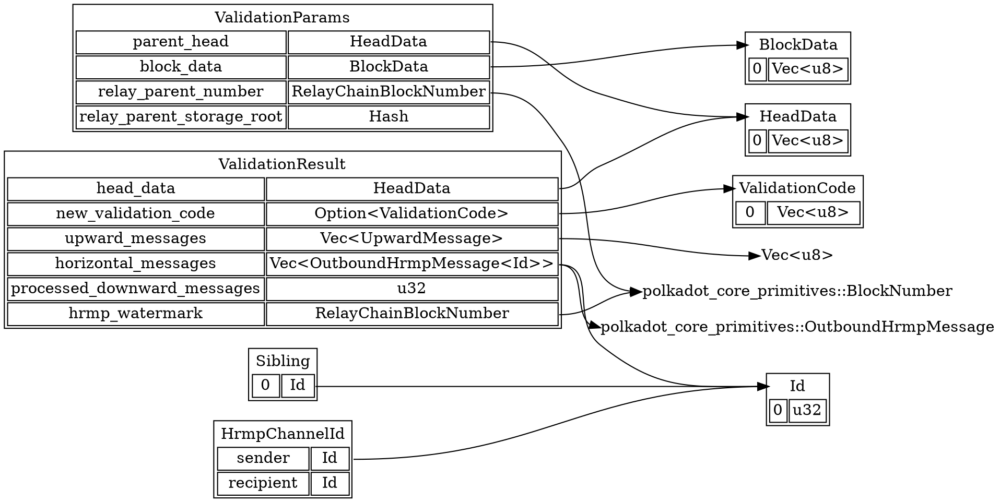

# Type Definitions

This section of the guide provides type definitions of various categories.

## V1 Overview

Diagrams are rendered in high resolution; open them in a separate tab to see full scale.

These data types are defined in `polkadot/primitives/src/v1.rs`:

```dot process
digraph {
    rankdir = LR;
    node [shape = plain]

    CandidateDescriptor [label = <
        <table>
            <tr><td border="0" colspan="2" port="name">CandidateDescriptor&lt;H = Hash&gt;</td></tr>
            <tr><td>para_id</td><td port="para_id">Id</td></tr>
            <tr><td>relay_parent</td><td port="relay_parent">H</td></tr>
            <tr><td>collator</td><td port="collator">CollatorId</td></tr>
            <tr><td>persisted_validation_data_hash</td><td port="persisted_validation_data_hash">Hash</td></tr>
            <tr><td>pov_hash</td><td port="pov_hash">Hash</td></tr>
            <tr><td>erasure_root</td><td port="erasure_root">Hash</td></tr>
            <tr><td>signature</td><td port="signature">CollatorSignature</td></tr>
        </table>
    >]

    CandidateDescriptor:para_id -> Id:w
    CandidateDescriptor:pov_hash -> PoVHash
    CandidateDescriptor:collator -> CollatorId:w
    CandidateDescriptor:persisted_validation_data_hash -> PersistedValidationDataHash

    Id [label="polkadot_parachain::primitives::Id"]
    CollatorId [label="polkadot_primitives::v2::CollatorId"]

    PoVHash [label = "Hash", shape="doublecircle", fill="gray90"]

    PoVHash -> PoV:name

    CandidateReceipt [label = <
        <table>
            <tr><td border="0" colspan="2" port="name">CandidateReceipt&lt;H = Hash&gt;</td></tr>
            <tr><td>descriptor</td><td port="descriptor">CandidateDescriptor&lt;H&gt;</td></tr>
            <tr><td>commitments_hash</td><td port="commitments_hash">Hash</td></tr>
        </table>
    >]

    CandidateReceipt:descriptor -> CandidateDescriptor:name
    CandidateReceipt:commitments_hash -> CandidateCommitmentsHash

    CandidateHash [label = "Hash", shape="doublecircle", fill="gray90"]
    CandidateHash -> CandidateReceipt:name

    CandidateCommitmentsHash [label = "Hash", shape="doublecircle", fill="gray90"]
    CandidateCommitmentsHash -> CandidateCommitments:name

    FullCandidateReceipt [label = <
        <table>
            <tr><td border="0" colspan="2" port="name">FullCandidateReceipt&lt;H = Hash, N = BlockNumber&gt;</td></tr>
            <tr><td>inner</td><td port="inner">CandidateReceipt&lt;H&gt;</td></tr>
            <tr><td>validation_data</td><td port="validation_data">ValidationData&lt;N&gt;</td></tr>
        </table>
    >]

    FullCandidateReceipt:inner -> CandidateReceipt:name
    FullCandidateReceipt:validation_data -> ValidationData:name

    CommittedCandidateReceipt [label = <
        <table>
            <tr><td border="0" colspan="2" port="name">CommittedCandidateReceipt&lt;H = Hash&gt;</td></tr>
            <tr><td>descriptor</td><td port="descriptor">CandidateDescriptor&lt;H&gt;</td></tr>
            <tr><td>commitments</td><td port="commitments">CandidateCommitments</td></tr>
        </table>
    >]

    CommittedCandidateReceipt:descriptor -> CandidateDescriptor:name
    CommittedCandidateReceipt:commitments -> CandidateCommitments:name

    ValidationData [label = <
        <table>
            <tr><td border="0" colspan="2" port="name">ValidationData&lt;N = BlockNumber&gt;</td></tr>
            <tr><td>persisted</td><td port="persisted">PersistedValidationData&lt;N&gt;</td></tr>
            <tr><td>transient</td><td port="transient">TransientValidationData&lt;N&gt;</td></tr>
        </table>
    >]

    ValidationData:persisted -> PersistedValidationData:name
    ValidationData:transient -> TransientValidationData:name

    PersistedValidationData [label = <
        <table>
            <tr><td border="0" colspan="2" port="name">PersistedValidationData&lt;N = BlockNumber&gt;</td></tr>
            <tr><td>parent_head</td><td port="parent_head">HeadData</td></tr>
            <tr><td>block_number</td><td port="block_number">N</td></tr>
            <tr><td>relay_parent_storage_root</td><td port="relay_parent_storage_root">Hash</td></tr>
            <tr><td>max_pov_size</td><td port="max_pov_size">u32</td></tr>
        </table>
    >]

    PersistedValidationData:parent_head -> HeadData:w

    PersistedValidationDataHash [label = "Hash", shape="doublecircle", fill="gray90"]
    PersistedValidationDataHash -> PersistedValidationData:name

    TransientValidationData [label = <
        <table>
            <tr><td border="0" colspan="2" port="name">TransientValidationData&lt;N = BlockNumber&gt;</td></tr>
            <tr><td>max_code_size</td><td port="max_code_size">u32</td></tr>
            <tr><td>max_head_data_size</td><td port="max_head_data_size">u32</td></tr>
            <tr><td>balance</td><td port="balance">Balance</td></tr>
            <tr><td>code_upgrade_allowed</td><td port="code_upgrade_allowed">Option&lt;N&gt;</td></tr>
            <tr><td>dmq_length</td><td port="dmq_length">u32</td></tr>
        </table>
    >]

    TransientValidationData:balance -> "polkadot_core_primitives::v2::Balance":w

    CandidateCommitments [label = <
        <table>
            <tr><td border="0" colspan="2" port="name">CandidateCommitments&lt;N = BlockNumber&gt;</td></tr>
            <tr><td>upward_messages</td><td port="upward_messages">Vec&lt;UpwardMessage&gt;</td></tr>
            <tr><td>horizontal_messages</td><td port="horizontal_messages">Vec&lt;OutboundHrmpMessage&lt;Id&gt;&gt;</td></tr>
            <tr><td>new_validation_code</td><td port="new_validation_code">Option&lt;ValidationCode&gt;</td></tr>
            <tr><td>head_data</td><td port="head_data">HeadData</td></tr>
            <tr><td>processed_downward_messages</td><td port="processed_downward_messages">u32</td></tr>
            <tr><td>hrmp_watermark</td><td port="hrmp_watermark">N</td></tr>
        </table>
    >]

    CandidateCommitments:upward_messages -> "polkadot_parachain::primitives::UpwardMessage":w
    CandidateCommitments:horizontal_messages -> "polkadot_core_primitives::v2::OutboundHrmpMessage":w
    CandidateCommitments:head_data -> HeadData:w
    CandidateCommitments:horizontal_messages -> "polkadot_parachain::primitives::Id":w
    CandidateCommitments:new_validation_code -> "polkadot_parachain::primitives::ValidationCode":w

    PoV [label = <
        <table>
            <tr><td border="0" colspan="2" port="name">PoV</td></tr>
            <tr><td>block_data</td><td port="block_data">BlockData</td></tr>
        </table>
    >]

    PoV:block_data -> "polkadot_parachain::primitives::BlockData":w

    BackedCandidate [label = <
        <table>
            <tr><td border="0" colspan="2" port="name">BackedCandidate&lt;H = Hash&gt;</td></tr>
            <tr><td>candidate</td><td port="candidate">CommittedCandidateReceipt&lt;H&gt;</td></tr>
            <tr><td>validity_votes</td><td port="validity_votes">Vec&lt;ValidityAttestation&gt;</td></tr>
            <tr><td>validator_indices</td><td port="validator_indices">BitVec</td></tr>
        </table>
    >]

    BackedCandidate:candidate -> CommittedCandidateReceipt:name
    BackedCandidate:validity_votes  -> "polkadot_primitives:v0:ValidityAttestation":w

    HeadData [label = "polkadot_parachain::primitives::HeadData"]

    CoreIndex [label = <
        <table>
            <tr><td border="0" colspan="2" port="name">CoreIndex</td></tr>
            <tr><td>0</td><td port="0">u32</td></tr>
        </table>
    >]

    GroupIndex [label = <
        <table>
            <tr><td border="0" colspan="2" port="name">GroupIndex</td></tr>
            <tr><td>0</td><td port="0">u32</td></tr>
        </table>
    >]

    ParathreadClaim [label = <
        <table>
            <tr><td border="0" colspan="2" port="name">ParathreadClaim</td></tr>
            <tr><td>0</td><td port="0">Id</td></tr>
            <tr><td>1</td><td port="1">CollatorId</td></tr>
        </table>
    >]

    ParathreadClaim:0 -> Id:w
    ParathreadClaim:1 -> CollatorId:w

    MessageQueueChainLink [label = "(prev_head, B, H(M))\nSee doc of AbridgedHrmpChannel::mqc_head"]
    MQCHash [label = "Hash", shape="doublecircle", fill="gray90"]

    MQCHash -> MessageQueueChainLink

    ParathreadEntry [label = <
        <table>
            <tr><td border="0" colspan="2" port="name">ParathreadEntry</td></tr>
            <tr><td>claim</td><td port="claim">ParathreadClaim</td></tr>
            <tr><td>retries</td><td port="retries">u32</td></tr>
        </table>
    >]

    ParathreadEntry:claim -> ParathreadClaim:name

    CoreOccupied [label = <
        <table>
            <tr><td border="0" colspan="2" port="name"><i>enum</i> CoreOccupied</td></tr>
            <tr><td></td><td port="parathread">Parathread(ParathreadEntry)</td></tr>
            <tr><td></td><td port="parachain">Parachain</td></tr>
        </table>
    >]

    CoreOccupied:parathread -> ParathreadEntry:name

    AvailableData [label = <
        <table>
            <tr><td border="0" colspan="2" port="name">AvailableData</td></tr>
            <tr><td>pov</td><td port="pov">Arc&lt;PoV&gt;</td></tr>
            <tr><td>validation_data</td><td port="validation_data">PersistedValidationData</td></tr>
        </table>
    >]

    AvailableData:pov -> PoV:name
    AvailableData:validation_data -> PersistedValidationData:name

    GroupRotationInfo [label = <
        <table>
            <tr><td border="0" colspan="2" port="name">GroupRotationInfo&lt;N = BlockNumber&gt;</td></tr>
            <tr><td>session_start_block</td><td port="session_start_block">N</td></tr>
            <tr><td>group_rotation_frequency</td><td port="group_rotation_frequency">N</td></tr>
            <tr><td>now</td><td port="now">N</td></tr>
        </table>
    >]

    OccupiedCore [label = <
        <table>
            <tr><td border="0" colspan="2" port="name">OccupiedCore&lt;H = Hash, N = BlockNumber&gt;</td></tr>
            <tr><td>next_up_on_available</td><td port="next_up_on_available">Option&lt;ScheduledCore&gt;</td></tr>
            <tr><td>occupied_since</td><td port="occupied_since">N</td></tr>
            <tr><td>time_out_at</td><td port="time_out_at">N</td></tr>
            <tr><td>next_up_on_time_out</td><td port="next_up_on_time_out">Option&lt;ScheduledCore&gt;</td></tr>
            <tr><td>availability</td><td port="availability">BitVec</td></tr>
            <tr><td>group_responsible</td><td port="group_responsible">GroupIndex</td></tr>
            <tr><td>candidate_hash</td><td port="candidate_hash">CandidateHash</td></tr>
            <tr><td>candidate_descriptor</td><td port="candidate_descriptor">CandidateDescriptor</td></tr>
        </table>
    >]

    OccupiedCore:next_up_on_available -> ScheduledCore:name
    OccupiedCore:next_up_on_time_out -> ScheduledCore:name
    OccupiedCore:group_responsible -> GroupIndex
    OccupiedCore:candidate_hash -> CandidateHash
    OccupiedCore:candidate_descriptor -> CandidateDescriptor:name

    ScheduledCore [label = <
        <table>
            <tr><td border="0" colspan="2" port="name">ScheduledCore</td></tr>
            <tr><td>para_id</td><td port="para_id">Id</td></tr>
            <tr><td>collator</td><td port="collator">Option&lt;CollatorId&gt;</td></tr>
        </table>
    >]

    ScheduledCore:para_id -> Id:w
    ScheduledCore:collator -> CollatorId:w

    CoreState [label = <
        <table>
            <tr><td border="0" colspan="2" port="name"><i>enum</i> CoreState&lt;H = Hash, N = BlockNumber&gt;</td></tr>
            <tr><td></td><td port="occupied">Occupied(OccupiedCore&lt;H, N&gt;)</td></tr>
            <tr><td></td><td port="scheduled">Scheduled(ScheduledCore)</td></tr>
            <tr><td></td><td port="free">Free</td></tr>
        </table>
    >]

    CoreState:occupied -> OccupiedCore:name
    CoreState:scheduled -> ScheduledCore:name

    CandidateEvent [label = <
        <table>
            <tr><td border="0" colspan="2" port="name"><i>enum</i> CandidateEvent&lt;H = Hash&gt;</td></tr>
            <tr><td></td><td port="CandidateBacked">CandidateBacked(CandidateReceipt&lt;H&gt;, HeadData)</td></tr>
            <tr><td></td><td port="CandidateIncluded">CandidateIncluded(CandidateReceipt&lt;H&gt;, HeadData)</td></tr>
            <tr><td></td><td port="CandidateTimedOut">CandidateTimedOut(CandidateReceipt&lt;H&gt;, HeadData)</td></tr>
        </table>
    >]

    CandidateEvent:e -> CandidateReceipt:name
    CandidateEvent:e -> HeadData:w

    SessionInfo [label = <
        <table>
            <tr><td border="0" colspan="2" port="name">SessionInfo</td></tr>
            <tr><td>validators</td><td port="validators">Vec&lt;ValidatorId&gt;</td></tr>
            <tr><td>discovery_keys</td><td port="discovery_keys">Vec&lt;AuthorityDiscoveryId&gt;</td></tr>
            <tr><td>assignment_keys</td><td port="assignment_keys">Vec&lt;AssignmentId&gt;</td></tr>
            <tr><td>validator_groups</td><td port="validator_groups">Vec&lt;Vec&lt;ValidatorIndex&gt;&gt;</td></tr>
            <tr><td>n_cores</td><td port="n_cores">u32</td></tr>
            <tr><td>zeroth_delay_tranche_width</td><td port="zeroth_delay_tranch_width">u32</td></tr>
            <tr><td>relay_vrf_modulo_samples</td><td port="relay_vrf_modulo_samples">u32</td></tr>
            <tr><td>n_delay_tranches</td><td port="n_delay_tranches">u32</td></tr>
            <tr><td>no_show_slots</td><td port="no_show_slots">u32</td></tr>
            <tr><td>needed_approvals</td><td port="needed_approvals">u32</td></tr>
        </table>
    >]

    SessionInfo:validators -> ValidatorId:w
    SessionInfo:discovery_keys -> AuthorityDiscoveryId:w
    SessionInfo:validator_groups -> ValidatorIndex:w

    ValidatorId [label = "polkadot_primitives::v2::ValidatorId"]
    AuthorityDiscoveryId [label = "sp_authority_discovery::AuthorityId"]
    ValidatorIndex [label = "polkadot_primitives::v2::ValidatorIndex"]

    AbridgedHostConfiguration [label = <
        <table>
            <tr><td border="0" colspan="2" port="name">AbridgedHostConfiguration</td></tr>
            <tr><td>max_code_size</td><td port="max_code_size">u32</td></tr>
            <tr><td>max_head_data_size</td><td port="max_head_data_size">u32</td></tr>
            <tr><td>max_upward_queue_count</td><td port="max_upward_queue_count">u32</td></tr>
            <tr><td>max_upward_queue_size</td><td port="max_upward_queue_size">u32</td></tr>
            <tr><td>max_upward_message_size</td><td port="max_upward_message_size">u32</td></tr>
            <tr><td>max_upward_messages_num_per_candidate</td><td port="max_upward_messages_num_per_candidate">u32</td></tr>
            <tr><td>hrmp_max_message_num_per_candidate</td><td port="hrmp_max_message_num_per_candidate">u32</td></tr>
            <tr><td>validation_upgrade_cooldown</td><td port="validation_upgrade_cooldown">BlockNumber</td></tr>
            <tr><td>validation_upgrade_delay</td><td port="validation_upgrade_delay">BlockNumber</td></tr>
        </table>
    >]

    AbridgedHrmpChannel [label = <
        <table>
            <tr><td border="0" colspan="2" port="name">AbridgedHrmpChannel</td></tr>
            <tr><td>max_capacity</td><td port="max_capacity">u32</td></tr>
            <tr><td>max_total_size</td><td port="max_total_size">u32</td></tr>
            <tr><td>max_message_size</td><td port="max_message_size">u32</td></tr>
            <tr><td>msg_count</td><td port="msg_count">u32</td></tr>
            <tr><td>total_size</td><td port="total_size">u32</td></tr>
            <tr><td>mqc_head</td><td port="mqc_head">Option&lt;Hash&gt;</td></tr>
        </table>
    >]

    AbridgedHrmpChannel:mqc_head -> MQCHash
}
```

These data types are defined in `polkadot/parachain/src/primitives.rs`:

