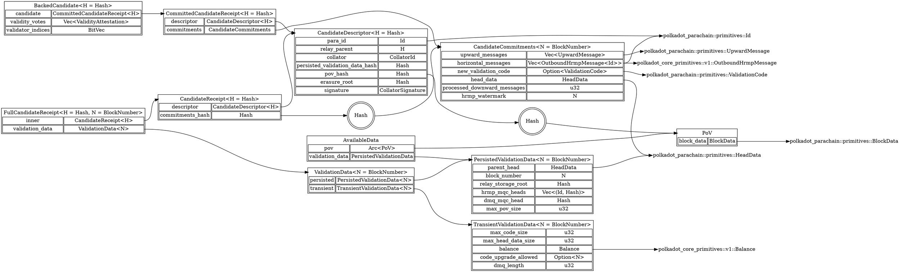

# Type Definitions

This section of the guide provides type definitions of various categories.

## V1 Overview

These data types are defined in `polkadot/primitives/src/v1.rs`:

```dot process
digraph {
    rankdir = LR;
    node [shape = plain]

    CandidateDescriptor [label = <
        <table>
            <tr><td border="0" colspan="2" port="name">CandidateDescriptor&lt;H = Hash&gt;</td></tr>
            <tr><td>para_id</td><td port="para_id">Id</td></tr>
            <tr><td>relay_parent</td><td port="relay_parent">H</td></tr>
            <tr><td>collator</td><td port="collator">CollatorId</td></tr>
            <tr><td>persisted_validation_data_hash</td><td port="persisted_validation_data_hash">Hash</td></tr>
            <tr><td>pov_hash</td><td port="pov_hash">Hash</td></tr>
            <tr><td>erasure_root</td><td port="erasure_root">Hash</td></tr>
            <tr><td>signature</td><td port="signature">CollatorSignature</td></tr>
        </table>
    >]

    CandidateDescriptor:para_id -> "polkadot_parachain::primitives::Id":w
    CandidateDescriptor:pov_hash -> PoVHash

    PoVHash [label = "Hash", shape="doublecircle", fill="lightgray"]

    PoVHash -> PoV:name

    CandidateReceipt [label = <
        <table>
            <tr><td border="0" colspan="2" port="name">CandidateReceipt&lt;H = Hash&gt;</td></tr>
            <tr><td>descriptor</td><td port="descriptor">CandidateDescriptor&lt;H&gt;</td></tr>
            <tr><td>commitments_hash</td><td port="commitments_hash">Hash</td></tr>
        </table>
    >]

    CandidateReceipt:descriptor -> CandidateDescriptor:name
    CandidateReceipt:commitments_hash -> CandidateCommitmentsHash

    CandidateCommitmentsHash [label = "Hash", shape="doublecircle", fill="lightgray"]

    CandidateCommitmentsHash -> CandidateCommitments:name

    FullCandidateReceipt [label = <
        <table>
            <tr><td border="0" colspan="2" port="name">FullCandidateReceipt&lt;H = Hash, N = BlockNumber&gt;</td></tr>
            <tr><td>inner</td><td port="inner">CandidateReceipt&lt;H&gt;</td></tr>
            <tr><td>validation_data</td><td port="validation_data">ValidationData&lt;N&gt;</td></tr>
        </table>
    >]

    FullCandidateReceipt:inner -> CandidateReceipt:name
    FullCandidateReceipt:validation_data -> ValidationData:name

    CommittedCandidateReceipt [label = <
        <table>
            <tr><td border="0" colspan="2" port="name">CommittedCandidateReceipt&lt;H = Hash&gt;</td></tr>
            <tr><td>descriptor</td><td port="descriptor">CandidateDescriptor&lt;H&gt;</td></tr>
            <tr><td>commitments</td><td port="commitments">CandidateCommitments</td></tr>
        </table>
    >]

    CommittedCandidateReceipt:descriptor -> CandidateDescriptor:name
    CommittedCandidateReceipt:commitments -> CandidateCommitments:name

    ValidationData [label = <
        <table>
            <tr><td border="0" colspan="2" port="name">ValidationData&lt;N = BlockNumber&gt;</td></tr>
            <tr><td>persisted</td><td port="persisted">PersistedValidationData&lt;N&gt;</td></tr>
            <tr><td>transient</td><td port="transient">TransientValidationData&lt;N&gt;</td></tr>
        </table>
    >]

    ValidationData:persisted -> PersistedValidationData:name
    ValidationData:transient -> TransientValidationData:name

    PersistedValidationData [label = <
        <table>
            <tr><td border="0" colspan="2" port="name">PersistedValidationData&lt;N = BlockNumber&gt;</td></tr>
            <tr><td>parent_head</td><td port="parent_head">HeadData</td></tr>
            <tr><td>block_number</td><td port="block_number">N</td></tr>
            <tr><td>relay_storage_root</td><td port="relay_storage_root">Hash</td></tr>
            <tr><td>hrmp_mqc_heads</td><td port="hrmp_mqc_heads">Vec&lt;(Id, Hash)&gt;</td></tr>
            <tr><td>dmq_mqc_head</td><td port="dmq_mqc_head">Hash</td></tr>
            <tr><td>max_pov_size</td><td port="max_pov_size">u32</td></tr>
        </table>
    >]

    PersistedValidationData:parent_head -> HeadData:w

    TransientValidationData [label = <
        <table>
            <tr><td border="0" colspan="2" port="name">TransientValidationData&lt;N = BlockNumber&gt;</td></tr>
            <tr><td>max_code_size</td><td port="max_code_size">u32</td></tr>
            <tr><td>max_head_data_size</td><td port="max_head_data_size">u32</td></tr>
            <tr><td>balance</td><td port="balance">Balance</td></tr>
            <tr><td>code_upgrade_allowed</td><td port="code_upgrade_allowed">Option&lt;N&gt;</td></tr>
            <tr><td>dmq_length</td><td port="dmq_length">u32</td></tr>
        </table>
    >]

    TransientValidationData:balance -> "polkadot_core_primitives::v1::Balance":w

    CandidateCommitments [label = <
        <table>
            <tr><td border="0" colspan="2" port="name">CandidateCommitments&lt;N = BlockNumber&gt;</td></tr>
            <tr><td>upward_messages</td><td port="upward_messages">Vec&lt;UpwardMessage&gt;</td></tr>
            <tr><td>horizontal_messages</td><td port="horizontal_messages">Vec&lt;OutboundHrmpMessage&lt;Id&gt;&gt;</td></tr>
            <tr><td>new_validation_code</td><td port="new_validation_code">Option&lt;ValidationCode&gt;</td></tr>
            <tr><td>head_data</td><td port="head_data">HeadData</td></tr>
            <tr><td>processed_downward_messages</td><td port="processed_downward_messages">u32</td></tr>
            <tr><td>hrmp_watermark</td><td port="hrmp_watermark">N</td></tr>
        </table>
    >]

    CandidateCommitments:upward_messages -> "polkadot_parachain::primitives::UpwardMessage":w
    CandidateCommitments:horizontal_messages -> "polkadot_core_primitives::v1::OutboundHrmpMessage":w
    CandidateCommitments:head_data -> HeadData:w
    CandidateCommitments:horizontal_messages -> "polkadot_parachain::primitives::Id":w
    CandidateCommitments:new_validation_code -> "polkadot_parachain::primitives::ValidationCode":w

    PoV [label = <
        <table>
            <tr><td border="0" colspan="2" port="name">PoV</td></tr>
            <tr><td>block_data</td><td port="block_data">BlockData</td></tr>
        </table>
    >]

    PoV:block_data -> "polkadot_parachain::primitives::BlockData":w

    BackedCandidate [label = <
        <table>
            <tr><td border="0" colspan="2" port="name">BackedCandidate&lt;H = Hash&gt;</td></tr>
            <tr><td>candidate</td><td port="candidate">CommittedCandidateReceipt&lt;H&gt;</td></tr>
            <tr><td>validity_votes</td><td port="validity_votes">Vec&lt;ValidityAttestation&gt;</td></tr>
            <tr><td>validator_indices</td><td port="validator_indices">BitVec</td></tr>
        </table>
    >]

    BackedCandidate:candidate -> CommittedCandidateReceipt:name

    AvailableData [label = <
        <table>
            <tr><td border="0" colspan="2" port="name">AvailableData</td></tr>
            <tr><td>pov</td><td port="pov">Arc&lt;PoV&gt;</td></tr>
            <tr><td>validation_data</td><td port="validation_data">PersistedValidationData</td></tr>
        </table>
    >]

    AvailableData:pov -> PoV:name
    AvailableData:validation_data -> PersistedValidationData:name

    HeadData [label = "polkadot_parachain::primitives::HeadData"]
}
```
